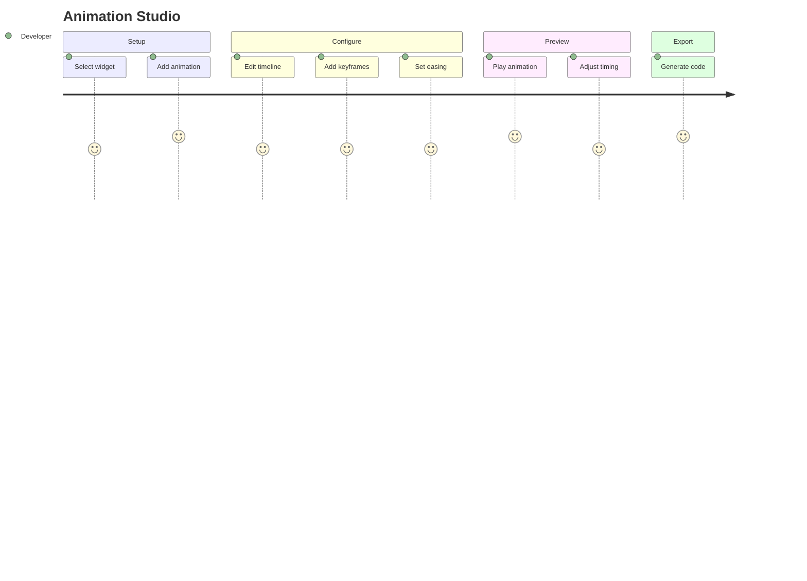

# Journey: Animation Studio

> User adds animations to widgets, configures timeline, previews motion, and exports animation code.

## Metadata

```yaml
actor: Pragmatic Flutter Developer
platform: desktop
locales: [en]
offline_capable: true
entry_points:
  - Animation panel/tab
  - Widget context menu > Add Animation
  - Keyboard shortcut Cmd/Ctrl+5
success_metric: Widget animation configured and previewed successfully
priority: P2
estimated_duration: 2-5 minutes per animation
related_journeys:
  - ../editor/design-canvas.md
  - ../editor/properties-panel.md
  - ../export/code-generation.md
  - ../theming/design-system.md
last_updated: 2026-01-21
requirements: [FR9.1, FR9.2, FR9.3, FR9.4, FR9.5]
```

## Flow Overview



---

## Stage 1: Add Animation to Widget

**Goal**: User attaches animation to selected widget

**Preconditions**:
- Widget is selected on canvas
- Animation panel accessible

**Flow**:
1. User selects widget to animate
2. User opens Animation panel or right-click > Add Animation
3. User selects animation type (fade, slide, scale, etc.)
4. System creates animation track for widget (FR9.1)
5. Widget shows animation indicator

**Acceptance Criteria**:

```gherkin
Scenario: Add fade animation
  Given Container widget is selected
  When user opens Animation panel
  And clicks "Add Animation"
  And selects "Fade" type
  Then fade animation track creates (FR9.1)
  And timeline panel shows animation track
  And widget shows animation badge

Scenario: Animation types available
  Given Add Animation dialog is open
  Then animation options include:
    - Fade (opacity)
    - Slide (offset)
    - Scale (transform)
    - Rotate (transform)
    - Custom (property keyframes)
  And each shows preview thumbnail

Scenario: Add multiple animations
  Given widget already has fade animation
  When user adds slide animation
  Then both tracks appear in timeline
  And animations can run concurrently or sequenced

Scenario: Add animation via context menu
  Given widget is right-clicked
  Then context menu shows "Add Animation" submenu
  When user selects animation type
  Then animation adds to widget

Scenario: Animation indicator on canvas
  Given widget has animation
  Then widget shows small animation icon
  And icon clickable to open Animation panel
```

**Edge Cases**:

| Trigger | System Response | User Recovery |
|---------|-----------------|---------------|
| Add animation to nested child | Allow, specify scope | None needed |
| Add incompatible animation | Warning if property not animatable | Choose different type |
| Too many animations (>10 on widget) | Performance warning | Reduce complexity |

**UX Requirements**:
- Animation types: Common presets + custom
- Add animation: <100ms to create track
- Visual indicator: Non-intrusive badge
- Preview thumbnail: Shows animation effect

**Emotional State**: 4 - Starting to add motion

---

## Stage 2: Timeline Panel

**Goal**: User views and edits animation timeline with multiple tracks

**Preconditions**:
- Widget has at least one animation
- Timeline panel is visible

**Flow**:
1. User opens timeline panel (FR9.1)
2. System shows multi-track timeline editor
3. User views animation duration, keyframes, tracks
4. User can zoom and scroll timeline
5. User can drag playhead to scrub

**Acceptance Criteria**:

```gherkin
Scenario: View timeline panel
  Given widget has fade and slide animations
  When user opens timeline panel (FR9.1)
  Then panel shows:
    - Horizontal timeline with time markers
    - Track for each animation
    - Playhead at current position
    - Keyframe markers on tracks

Scenario: Timeline zoom
  Given timeline is visible
  When user scrolls with Cmd/Ctrl+wheel
  Then timeline zooms in/out
  And time markers adjust granularity
  And keyframes maintain relative positions

Scenario: Scrub timeline
  Given timeline has animations
  When user drags playhead
  Then canvas preview updates in real-time
  And shows widget at that point in animation

Scenario: Resize tracks
  Given multiple tracks visible
  When user drags track divider
  Then track heights adjust
  And more detail visible for expanded tracks

Scenario: Track operations
  Given animation track is selected
  Then user can:
    - Duplicate track
    - Delete track
    - Lock track (prevent editing)
    - Hide track (skip in preview)
```

**Edge Cases**:

| Trigger | System Response | User Recovery |
|---------|-----------------|---------------|
| Very long animation (>10s) | Timeline scroll, overview available | Zoom out |
| No animations | Show "Add animation" prompt | Add animation |
| Very many tracks (>20) | Virtualized scrolling | Reduce complexity |
| Timeline zoom limits | Clamp at useful range | Accept limits |

**UX Requirements**:
- Timeline render: 60fps during scrubbing
- Zoom range: 100ms to 30s visible
- Track minimum height: 24px
- Playhead: Draggable with snap-to-keyframe option

**Emotional State**: 4 - Visual control over timing

---

## Stage 3: Property Keyframing

**Goal**: User adds keyframes to animate property values over time

**Preconditions**:
- Animation track exists
- User wants to define animation values

**Flow**:
1. User selects animation track (FR9.2)
2. User moves playhead to desired time
3. User sets property value at that time
4. System creates keyframe (FR9.2)
5. Animation interpolates between keyframes

**Acceptance Criteria**:

```gherkin
Scenario: Add keyframe at playhead
  Given fade animation track selected
  And playhead at 0ms
  When user sets opacity to 0.0
  Then keyframe creates at 0ms with opacity 0.0
  When user moves playhead to 500ms
  And sets opacity to 1.0
  Then keyframe creates at 500ms
  And animation interpolates 0.0 -> 1.0 (FR9.2)

Scenario: Edit existing keyframe
  Given keyframe exists at 500ms
  When user clicks keyframe marker
  Then keyframe inspector opens
  And user can edit value and timing
  When user changes value
  Then animation updates

Scenario: Delete keyframe
  Given keyframe is selected
  When user presses Delete
  Then keyframe removes
  And animation recalculates

Scenario: Move keyframe in time
  Given keyframe exists at 500ms
  When user drags keyframe marker to 300ms
  Then keyframe timing changes
  And animation updates

Scenario: Multi-property keyframes
  Given custom animation track
  When user keyframes multiple properties
  Then each property can have independent keyframes
  And properties animate independently
```

**Edge Cases**:

| Trigger | System Response | User Recovery |
|---------|-----------------|---------------|
| Keyframe at same time as existing | Replace or merge | Choose action |
| Keyframe value invalid | Validation error | Correct value |
| Delete only keyframe | Track becomes empty (constant value) | Add new keyframe |
| Very many keyframes (>50) | Performance warning | Simplify |

**UX Requirements**:
- Keyframe creation: Single click or value change at playhead
- Keyframe editing: Inline inspector
- Drag precision: Snap to frame (16.67ms at 60fps)
- Visual: Clear markers for keyframes

**Emotional State**: 4 - Precise control over motion

---

## Stage 4: Easing Editor

**Goal**: User configures easing curves for smooth motion

**Preconditions**:
- Animation has multiple keyframes
- User wants to control interpolation

**Flow**:
1. User selects keyframe or track
2. User opens easing editor (FR9.3)
3. User selects preset or edits cubic-bezier curve
4. Canvas preview reflects easing change
5. Animation feels smooth and natural

**Acceptance Criteria**:

```gherkin
Scenario: Select easing preset
  Given animation track selected
  When user opens easing dropdown
  Then presets show:
    - Linear
    - Ease In
    - Ease Out
    - Ease In Out
    - Bounce
    - Spring
    - Custom
  When user selects "Ease In Out"
  Then animation uses that curve

Scenario: Custom cubic-bezier editor
  Given user selects "Custom" easing (FR9.3)
  Then bezier curve editor opens
  And shows control points for curve
  When user drags control points
  Then curve shape changes
  And preview updates in real-time
  And values show: cubic-bezier(x1, y1, x2, y2)

Scenario: Per-segment easing
  Given animation has 3 keyframes (A, B, C)
  When user selects segment A-B
  Then can set easing for that segment only
  And segment B-C can have different easing

Scenario: Preview easing effect
  Given easing is being edited
  Then mini-preview shows animation with easing
  And can loop preview continuously
  And actual widget updates on canvas

Scenario: Import easing from design tokens
  Given design tokens have motion.easeStandard
  When user opens easing editor
  Then token-based easings available
  When selected
  Then easing binds to token
```

**Edge Cases**:

| Trigger | System Response | User Recovery |
|---------|-----------------|---------------|
| Invalid bezier values | Clamp to valid range | Adjust points |
| Extreme bounce values | Warning about over-animation | Reduce intensity |
| Reset to default | Quick reset button | Click reset |

**UX Requirements**:
- Preset selection: Single click
- Custom editor: Draggable bezier handles
- Preview: Real-time curve visualization
- Values: Show numeric values for dev reference

**Emotional State**: 5 - Animation feels professional

---

## Stage 5: Animation Triggers

**Goal**: User defines when animation starts (on load, tap, scroll, etc.)

**Preconditions**:
- Animation is configured
- User wants to control when it plays

**Flow**:
1. User selects animation track
2. User opens trigger options (FR9.4)
3. User selects trigger type
4. User configures trigger parameters
5. Animation plays when trigger fires

**Acceptance Criteria**:

```gherkin
Scenario: OnLoad trigger
  Given animation track selected
  When user sets trigger to "OnLoad" (FR9.4)
  Then animation plays when widget mounts
  And plays automatically in preview

Scenario: OnTap trigger
  Given animation track selected
  When user sets trigger to "OnTap"
  Then animation plays when widget tapped
  And preview shows tap interaction area
  And can configure toggle (play forward/reverse on alternating taps)

Scenario: OnVisible trigger
  Given animation track selected
  When user sets trigger to "OnVisible"
  Then animation plays when widget enters viewport
  And configurable: percentage visible, once or repeat

Scenario: OnScroll trigger
  Given animation track selected
  And widget is in scrollable parent
  When user sets trigger to "OnScroll"
  Then animation progress tied to scroll position (FR9.4)
  And configurable: scroll range, easing

Scenario: Trigger delay
  Given trigger is set
  When user adds delay of 500ms
  Then animation waits before playing
  And delay shown in timeline

Scenario: Multiple triggers
  Given animation has OnLoad trigger
  When user adds OnTap trigger
  Then both triggers can activate animation
  And logic is OR (either trigger plays)
```

**Edge Cases**:

| Trigger | System Response | User Recovery |
|---------|-----------------|---------------|
| OnVisible without scroll parent | Warning, suggest OnLoad | Change trigger |
| OnScroll without scroll parent | Error | Add scroll wrapper |
| Conflicting triggers | Allow, first trigger wins | Prioritize or remove |

**UX Requirements**:
- Trigger selection: Dropdown with descriptions
- Trigger preview: Simulate trigger in preview mode
- Delay: Simple numeric input
- Trigger indicator: Visual marker in timeline

**Emotional State**: 4 - Animations become interactive

---

## Stage 6: Staggered Animation

**Goal**: User creates orchestrated animations across multiple widgets

**Preconditions**:
- Multiple widgets have animations
- User wants coordinated timing

**Flow**:
1. User selects parent containing animated children
2. User opens stagger controls (FR9.5)
3. User configures stagger delay between children
4. System orchestrates child animations
5. Preview shows cascading effect

**Acceptance Criteria**:

```gherkin
Scenario: Enable stagger on parent
  Given Column has 3 Text children with fade animations
  When user selects Column
  And enables "Stagger Children" (FR9.5)
  And sets stagger delay to 100ms
  Then:
    - Child 1 starts at 0ms
    - Child 2 starts at 100ms
    - Child 3 starts at 200ms
  And cascade effect visible in preview

Scenario: Stagger order options
  Given stagger is enabled
  Then order options available:
    - First to Last
    - Last to First
    - Random
    - Custom (manual ordering)
  When user selects "Last to First"
  Then animation order reverses

Scenario: Stagger with overlap
  Given stagger delay is 100ms
  And each child animation is 300ms
  Then animations overlap (child 2 starts before child 1 finishes)
  And smooth cascading effect

Scenario: Stagger preview
  Given stagger is configured
  When user plays preview
  Then all children animate with stagger
  And timeline shows staggered tracks

Scenario: Nested stagger
  Given parent A has staggered children
  And child B also has staggered grandchildren
  Then both staggers apply
  And complex orchestration possible
```

**Edge Cases**:

| Trigger | System Response | User Recovery |
|---------|-----------------|---------------|
| Stagger with no animated children | No visible effect, warning | Add child animations |
| Very long stagger (>2s between) | Warning about perception | Reduce delay |
| Dynamic children (e.g., list) | Stagger applies to current children | Accept dynamic |

**UX Requirements**:
- Stagger enable: Simple toggle
- Stagger delay: Numeric input with slider
- Order selection: Visual preview of order
- Preview: Full orchestration playback

**Emotional State**: 5 - Professional motion design

---

## Stage 7: Preview and Export

**Goal**: User previews animation and exports animation code

**Preconditions**:
- Animation is configured
- User ready to see result and export

**Flow**:
1. User clicks Play button or presses Space
2. Canvas plays animation from beginning
3. User can pause, scrub, loop preview
4. User exports animation code with widget

**Acceptance Criteria**:

```gherkin
Scenario: Play animation preview
  Given animation is configured
  When user presses Play or Space
  Then animation plays on canvas
  And playhead moves in timeline
  And maintains 60fps

Scenario: Preview controls
  Given preview is playing
  Then controls available:
    - Play/Pause
    - Stop (reset to start)
    - Loop (toggle)
    - Speed (0.25x, 0.5x, 1x, 2x)
  And keyboard shortcuts work

Scenario: Export animation code
  Given animation configured
  When user opens code panel
  Then generated code includes:
    - flutter_animate code (if using presets)
    - AnimationController setup (if custom)
    - Proper initialization in initState/dispose
  And code compiles and runs

Scenario: Animation in generated widget
  Given widget has fade animation OnLoad
  Then generated code includes:
  ```dart
  class MyWidget extends StatefulWidget {
    // ... with AnimationController setup
    // ... build method with animated child
  }
  ```

Scenario: StatefulWidget requirement
  Given widget has animations
  When user exports
  Then StatefulWidget is used (not Stateless)
  And animation lifecycle managed correctly
```

**Edge Cases**:

| Trigger | System Response | User Recovery |
|---------|-----------------|---------------|
| Preview performance issues | Reduce quality or warn | Simplify animations |
| Export complex animation | May need manual adjustment | Accept and refine |
| Animation loops forever | Ensure export handles loop | Verify code |

**UX Requirements**:
- Preview playback: 60fps target
- Controls: Keyboard (Space = play/pause)
- Export quality: Compiling, runnable code
- flutter_animate: Preferred for simple animations

**Emotional State**: 5 - Animation ready for production

---

## Error Scenarios

| Error Type | Trigger Condition | User Message | Recovery Action | Fallback |
|------------|-------------------|--------------|-----------------|----------|
| Animation conflict | Two animations affect same property | "Property conflict: [property]" | Resolve conflict | Use first |
| Export failure | Complex animation not supported | "Animation may need manual adjustment" | Export with TODO | Partial export |
| Preview crash | Animation causes render error | "Preview failed" | Fix animation | Remove animation |
| Trigger incompatible | Trigger doesn't apply to widget | "Cannot use [trigger] here" | Choose valid trigger | None |

---

## Analytics Events

| Event Name | Trigger | Properties |
|------------|---------|------------|
| `animation_added` | New animation created | `animation_type`, `widget_type` |
| `keyframe_added` | Keyframe created | `property`, `time_ms` |
| `easing_changed` | Easing curve modified | `easing_type`, `is_custom` |
| `trigger_set` | Trigger configured | `trigger_type`, `has_delay` |
| `stagger_enabled` | Stagger turned on | `child_count`, `delay_ms` |
| `animation_previewed` | Preview played | `duration_ms`, `playback_speed` |
| `animation_exported` | Code generated | `animation_count`, `uses_flutter_animate` |

---

## Technical Notes

- Animation data stored in widget node's `animations` array
- Timeline uses custom `CustomPainter` for rendering
- Preview uses actual Flutter `AnimationController`
- Export prefers `flutter_animate` for common patterns
- Complex custom animations export raw controller code
- Keyframe interpolation uses standard Flutter `Tween` classes

---

## Validation Checklist

### Core UX
- [x] All stages have goal, preconditions, flow, acceptance criteria
- [x] Edge cases documented with recovery paths
- [x] UX requirements include specific thresholds (60fps preview)
- [x] Error scenarios cover animation, export failures
- [x] Analytics events capture animation workflow
- [x] Emotional journey tracked with 1-5 scores
- [x] Accessibility: keyboard controls, reduce motion consideration

### Desktop-Specific
- [x] Keyboard shortcuts (Space for play)
- [x] Timeline zoom/pan with modifiers
- [x] Context menu for animation options
- [x] Panel layout for timeline editor

---

## Comprehensiveness Evidence

| Pass | Completed | Findings |
|------|-----------|----------|
| Edge Case Audit | Yes | Added: too many animations, invalid bezier, export complex |
| ACUEPS Coverage | Yes | All stages have Performance (60fps), Error handling, Accessibility |
| Cross-Journey Validation | Yes | Links to canvas (preview), code generation (export), design system (tokens) |

**Edge cases added during audit:**
- Stage 1: Too many animations, incompatible animation
- Stage 2: Very long animation, timeline zoom limits
- Stage 3: Keyframe at same time, very many keyframes
- Stage 4: Extreme bounce, invalid bezier
- Stage 5: OnVisible without scroll, conflicting triggers
- Stage 6: No animated children, very long stagger
- Stage 7: Preview performance, complex export

**Cross-journey links verified:**
- Incoming: Canvas selection, Properties panel
- Outgoing: Code Generation (animation code), Design System (motion tokens)
