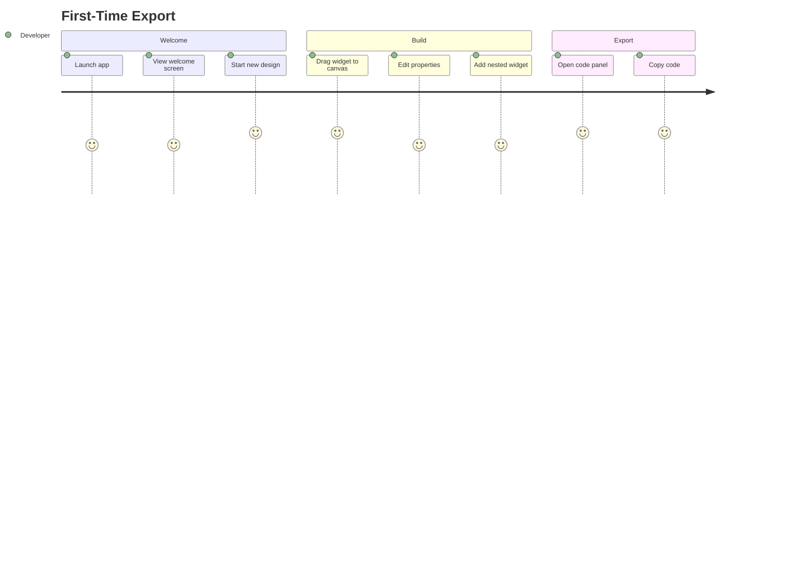

# Journey: First-Time Export

> New user achieves first successful code export within 5 minutes of launching FlutterForge.

## Metadata

```yaml
actor: Pragmatic Flutter Developer
platform: desktop
locales: [en]
offline_capable: true
entry_points:
  - Fresh application launch
  - Welcome screen "Start Building"
success_metric: Code exported to clipboard or file within 5 minutes
priority: P0
estimated_duration: 3-5 minutes
related_journeys:
  - ../editor/widget-palette.md
  - ../editor/design-canvas.md
  - ../editor/properties-panel.md
  - ../export/code-generation.md
last_updated: 2026-01-21
requirements: [NFR3.1, FR1, FR2, FR4, FR5]
```

## Flow Overview



---

## Stage 1: Application Launch

**Goal**: User launches app and reaches the main editor within 3 seconds

**Preconditions**:
- Application installed
- First launch or no existing project open

**Flow**:
1. User launches FlutterForge application
2. System displays splash screen with logo (if cold start >500ms)
3. System shows welcome screen with options
4. User selects "Start Building" or equivalent

**Acceptance Criteria**:

```gherkin
Scenario: Cold start within performance target
  Given FlutterForge is installed
  And no project is currently open
  When user launches the application
  Then main interface displays within 3 seconds (NFR1.3)
  And welcome screen shows "Start Building" option

Scenario: Returning user with recent projects
  Given user has previously saved projects
  When user launches the application
  Then recent projects list is visible
  And "Start Building" option remains accessible

Scenario: Keyboard navigation from launch
  Given welcome screen is displayed
  When user presses Enter or Space on "Start Building"
  Then editor workspace opens
  And focus moves to widget palette
```

**Edge Cases**:

| Trigger | System Response | User Recovery |
|---------|-----------------|---------------|
| First launch ever | Show brief feature highlights | "Skip" button to proceed |
| Crash on previous launch | Offer recovery of auto-saved work | Accept or start fresh |
| Slow disk I/O | Show "Loading workspace..." after 500ms | Wait or cancel |

**UX Requirements**:
- Application launch: <3 seconds (NFR1.3)
- Focus management: First interactive element focused on load
- Keyboard accessible: All welcome actions via keyboard (NFR3.2)

**Emotional State**: 4 - Curious, eager to explore

---

## Stage 2: Initial Widget Placement

**Goal**: User drags first widget from palette to canvas successfully

**Preconditions**:
- Editor workspace is open
- Canvas is empty
- Widget palette is visible

**Flow**:
1. User browses widget palette (categorized list)
2. User locates Container widget in Layout category
3. User drags Container from palette toward canvas
4. System shows drop zone indicator on canvas
5. User drops widget on canvas
6. System renders live Container widget on canvas
7. System auto-selects the dropped widget

**Acceptance Criteria**:

```gherkin
Scenario: Drag Container to empty canvas
  Given the editor workspace is open
  And the canvas is empty
  When user drags Container from palette to canvas
  Then drop zone indicator appears on canvas (FR2.2)
  And Container renders at drop location (FR2.1)
  And Container is auto-selected
  And selection overlay appears (FR2.4)
  And properties panel shows Container properties (FR4.4)

Scenario: Keyboard-based widget placement
  Given user has focus in widget palette
  When user navigates to Container using arrow keys
  And presses Enter or Space
  Then Container is added to canvas center
  And Container is auto-selected

Scenario: Drag feedback during hover
  Given user is dragging Container from palette
  When drag hovers over canvas area
  Then canvas shows drop zone highlight
  And drag cursor indicates droppable

Scenario: Cancel drag operation
  Given user is dragging a widget
  When user presses Escape
  Then drag operation cancels
  And canvas state unchanged
  And no widget added
```

**Edge Cases**:

| Trigger | System Response | User Recovery |
|---------|-----------------|---------------|
| Drop outside canvas | Widget not added, drag ends | Re-drag to canvas |
| Drop on invalid zone | Visual rejection indicator | Move to valid area |
| Rapid successive drops | Queue and process in order | None needed |
| Palette category collapsed | Expand on click/keyboard | Click category header |

**UX Requirements**:
- Drag initiation: <50ms response
- Drop feedback: Visual indicator within 16ms
- Widget render: <16ms after drop (60fps) (NFR1.1)
- Touch/click target: minimum 44x44 points (NFR4.4)

**Emotional State**: 5 - Delighted, immediate visual result

---

## Stage 3: Property Editing

**Goal**: User modifies widget properties and sees live preview

**Preconditions**:
- Widget is placed on canvas
- Widget is selected
- Properties panel is visible

**Flow**:
1. User views properties panel showing Container properties
2. User locates "width" or "color" property
3. User edits property value (double input or color picker)
4. System updates canvas preview in real-time
5. User sees change reflected immediately

**Acceptance Criteria**:

```gherkin
Scenario: Edit numeric property with live preview
  Given a Container is selected on canvas
  And properties panel shows Container properties
  When user changes width to 200
  Then canvas updates within 16ms (NFR1.1)
  And Container visually shows new width (FR4.5)

Scenario: Edit color property via color picker
  Given a Container is selected
  When user clicks color property field
  Then color picker opens (FR4.3)
  When user selects blue color
  Then Container background updates immediately
  And color picker remains open for further adjustment

Scenario: Edit padding via EdgeInsets editor
  Given a Container is selected
  When user opens padding property
  Then EdgeInsets editor displays (FR4.6)
  When user sets all sides to 16
  Then Container padding updates on canvas
  And child content repositions accordingly

Scenario: Keyboard property editing
  Given properties panel has focus
  When user tabs to width field
  And enters "150" and presses Enter
  Then width updates to 150
  And focus moves to next field
```

**Edge Cases**:

| Trigger | System Response | User Recovery |
|---------|-----------------|---------------|
| Invalid numeric value | Field shows validation error | Correct to valid number |
| Value exceeds reasonable bounds | Clamp and show warning | Adjust within bounds |
| Color picker outside viewport | Reposition to stay visible | None needed |
| Rapid value changes (typing) | Debounce preview updates (100ms) | None needed |

**UX Requirements**:
- Property change to preview: <16ms (NFR1.1)
- Input validation: Inline, immediate feedback
- Color picker: Standard platform picker or custom with alpha support
- Touch targets: All controls minimum 44x44 (NFR4.4)

**Emotional State**: 4 - Engaged, seeing direct cause-effect

---

## Stage 4: Add Nested Widget

**Goal**: User adds a child widget inside the Container

**Preconditions**:
- Container is on canvas
- Container is selected or visible
- User wants to add Text as child

**Flow**:
1. User locates Text widget in palette (Content category)
2. User drags Text toward Container on canvas
3. System shows nested drop zone inside Container (FR2.3)
4. User drops Text inside Container
5. System renders Text as child of Container
6. Widget tree panel shows hierarchy (FR3.1)

**Acceptance Criteria**:

```gherkin
Scenario: Drop Text inside Container
  Given a Container is on canvas
  When user drags Text widget over Container
  Then nested drop zone indicator appears (FR2.3)
  When user drops Text
  Then Text renders inside Container (FR2.1)
  And widget tree shows Container > Text hierarchy (FR3.1)
  And Text is auto-selected

Scenario: Tree reflects hierarchy accurately
  Given Container contains Text
  When user views widget tree panel
  Then Container node is expandable (FR3.5)
  And Text appears indented under Container
  And expand/collapse works correctly

Scenario: Select via tree panel
  Given Container contains Text
  And Container is selected
  When user clicks Text in widget tree
  Then Text becomes selected (FR3.2)
  And canvas selection overlay moves to Text
  And properties panel shows Text properties

Scenario: Single-child constraint
  Given Container already has one child
  When user attempts to drop second widget inside Container
  Then system rejects drop with visual indicator
  And tooltip explains "Container accepts one child"
```

**Edge Cases**:

| Trigger | System Response | User Recovery |
|---------|-----------------|---------------|
| Drop on single-child with existing child | Reject with explanation | Use multi-child (Column/Row) |
| Drop Expanded without Flex parent | Reject with explanation | Drop into Row/Column instead |
| Very deep nesting (>10 levels) | Allow with performance warning | Refactor hierarchy |
| Drag same widget type inside itself | Reject circular reference | Use different structure |

**UX Requirements**:
- Nested drop zone: Clear visual distinction from parent
- Hierarchy display: Indentation with collapse controls
- Selection sync: Tree and canvas stay synchronized (FR3.2)

**Emotional State**: 4 - Building confidence with nesting

---

## Stage 5: Code Generation and Export

**Goal**: User exports generated Dart code to clipboard or file

**Preconditions**:
- Canvas has at least one widget
- Design is ready for export

**Flow**:
1. User clicks "Code" tab or panel toggle
2. System displays live code preview (FR5.8)
3. User reviews generated Dart code
4. User clicks "Copy to Clipboard" button (FR5.6)
5. System copies code and shows confirmation
6. User pastes code into their IDE

**Acceptance Criteria**:

```gherkin
Scenario: View generated code
  Given canvas has Container with Text child
  When user opens code preview panel
  Then valid Dart code displays (FR5.1)
  And code is dart_style formatted (FR5.2)
  And StatelessWidget class is generated (FR5.3)
  And code syntax highlighting is applied

Scenario: Copy code to clipboard
  Given code preview is visible
  When user clicks "Copy to Clipboard"
  Then code is copied to system clipboard
  And confirmation message appears for 3 seconds
  And code compiles when pasted in Flutter project

Scenario: Export code to file
  Given code preview is visible
  When user clicks "Export to File" (FR5.7)
  Then file save dialog opens
  And default filename is "my_widget.dart"
  When user confirms save location
  Then .dart file is written
  And success confirmation appears

Scenario: Code generation performance
  Given canvas has 100 widgets
  When code preview opens
  Then code generates within 500ms (NFR1.2)
  And no UI freeze during generation

Scenario: Snippet export option
  Given user wants only widget code (not full class)
  When user selects "Snippet Only" option (FR5.5)
  Then generated code excludes class wrapper
  And only build method contents export
```

**Edge Cases**:

| Trigger | System Response | User Recovery |
|---------|-----------------|---------------|
| Empty canvas | Show placeholder message | Add widgets first |
| Code generation error | Show error with context | Fix widget configuration |
| Clipboard access denied | Show error, offer file export | Use file export |
| File write permission denied | Show path error | Choose accessible location |
| Very large widget tree | Show progress indicator | Wait for completion |

**UX Requirements**:
- Code generation: <500ms for 100 widgets (NFR1.2)
- Copy confirmation: Toast/snackbar for 3 seconds
- Syntax highlighting: Dart-aware coloring
- File dialog: Native platform dialog

**Emotional State**: 5 - Success achieved, code in hand

---

## Error Scenarios

| Error Type | Trigger Condition | User Message | Recovery Action | Fallback |
|------------|-------------------|--------------|-----------------|----------|
| Launch timeout | Startup exceeds 5 seconds | "Taking longer than expected..." | Auto-retry, contact support link | Force restart |
| Widget drop fail | Invalid drop target | "Cannot place here: [reason]" | Visual indicator of valid zones | Drag elsewhere |
| Property validation | Invalid value entered | "Please enter a valid [type]" | Inline correction | Reset to default |
| Code generation fail | Malformed widget tree | "Could not generate code for [widget]" | Highlight problem widget | Fix configuration |
| Export permission | File system access denied | "Cannot save to this location" | Choose different location | Copy to clipboard |

---

## Analytics Events

| Event Name | Trigger | Properties |
|------------|---------|------------|
| `app_launched` | Application start | `launch_type`, `launch_time_ms` |
| `first_widget_dropped` | First widget placed | `widget_type`, `time_since_launch_ms` |
| `property_edited` | Property value changed | `widget_type`, `property_name` |
| `nested_widget_added` | Child widget dropped | `parent_type`, `child_type`, `nesting_depth` |
| `code_previewed` | Code panel opened | `widget_count`, `generation_time_ms` |
| `code_exported` | Copy or file export | `export_type`, `code_lines`, `widget_count` |
| `first_export_completed` | First successful export | `total_time_ms`, `widget_count`, `interaction_count` |

---

## Technical Notes

- Code generation uses `code_builder` for AST-based output
- Widget tree uses normalized Map storage for O(1) access
- Canvas renders actual Flutter widgets via `DesignProxy` wrapper
- Property changes flow through command pattern for undo/redo support

---

## Validation Checklist

### Core UX
- [x] All stages have goal, preconditions, flow, acceptance criteria
- [x] Edge cases documented with recovery paths
- [x] UX requirements include specific thresholds (NFR1.1, NFR1.2, NFR1.3)
- [x] Error scenarios cover validation, permissions, generation failures
- [x] Analytics events capture full funnel
- [x] Emotional journey tracked with 1-5 scores
- [x] Cross-referenced with related journeys
- [x] Platform guidelines followed (desktop conventions)
- [x] Accessibility requirements embedded (keyboard nav, focus management)

### Desktop-Specific
- [x] Keyboard shortcuts documented (Appendix A of PRD)
- [x] Mouse and keyboard interaction patterns
- [x] Native file dialogs specified
- [x] Multi-window awareness considered
- [x] Focus management for panels

---

## Comprehensiveness Evidence

| Pass | Completed | Findings |
|------|-----------|----------|
| Edge Case Audit | Yes | Added 5 edge cases per stage: drag cancel, validation bounds, permission denials |
| ACUEPS Coverage | Yes | All stages have Accessibility (keyboard), Core, Usability (timing), Error, Performance (NFR refs) |
| Cross-Journey Validation | Yes | Links to palette, canvas, properties, code-generation journeys |
| Localization Review | N/A | Single locale (en) for MVP |
| Offline Design Review | N/A | Desktop app, always offline-capable |

**Edge cases added during audit:**
- Stage 1: Crash recovery, slow disk I/O
- Stage 2: Drop outside canvas, rapid successive drops
- Stage 3: Invalid numeric input, color picker positioning
- Stage 4: Single-child constraint, deep nesting warning
- Stage 5: Clipboard access denied, file permissions

**Cross-journey links verified:**
- Incoming: Fresh launch (entry point)
- Outgoing: Widget Palette (J02), Design Canvas (J03), Properties Panel (J05), Code Generation (J06)
