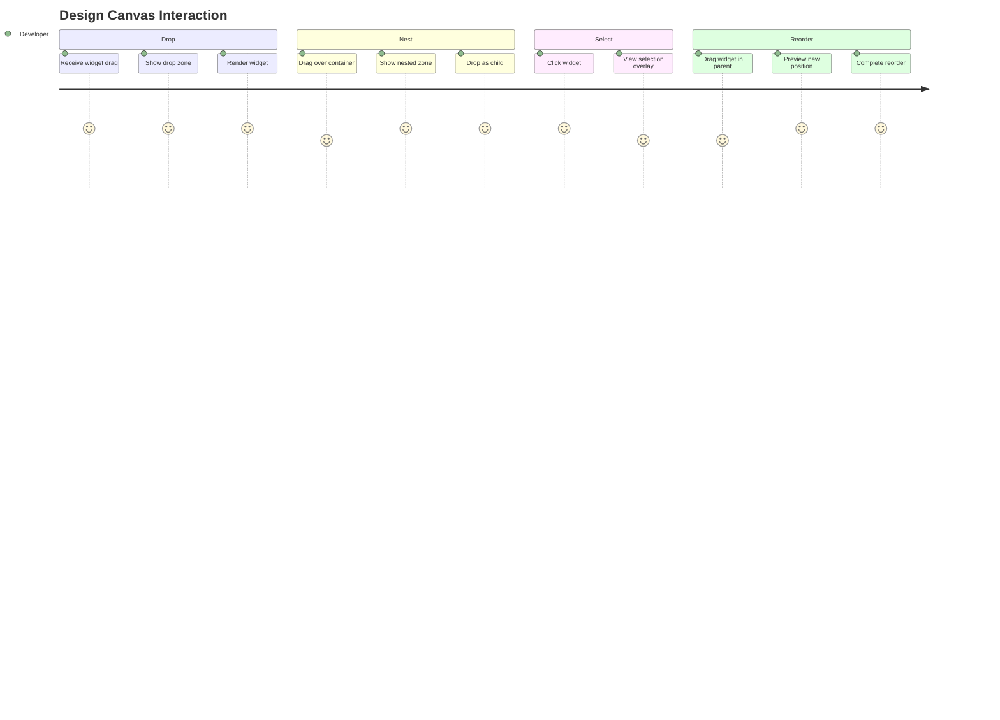

# Journey: Design Canvas

> User drops widgets onto canvas, creates nested hierarchies, selects widgets, and reorders layout.

## Metadata

```yaml
actor: Pragmatic Flutter Developer
platform: desktop
locales: [en]
offline_capable: true
entry_points:
  - Widget drag from palette
  - Paste operation (Cmd/Ctrl+V)
  - Widget tree selection
success_metric: Nested layout created with 3+ widgets in <2 minutes
priority: P0
estimated_duration: 2-5 minutes per layout iteration
related_journeys:
  - ../editor/widget-palette.md
  - ../editor/widget-tree.md
  - ../editor/properties-panel.md
last_updated: 2026-01-21
requirements: [FR2.1, FR2.2, FR2.3, FR2.4, FR2.5, FR2.6, FR2.7, FR2.8]
```

## Flow Overview



---

## Stage 1: Accept Drop from Palette

**Goal**: User drops widget from palette and sees it render live on canvas

**Preconditions**:
- Canvas is visible (center panel)
- Drag in progress from widget palette

**Flow**:
1. User drags widget from palette toward canvas
2. System detects drag entering canvas bounds
3. System displays drop zone indicator (FR2.2)
4. User releases widget over valid drop zone
5. System creates widget node in data model
6. System renders live Flutter widget on canvas (FR2.1)
7. System auto-selects dropped widget

**Acceptance Criteria**:

```gherkin
Scenario: Drop widget on empty canvas
  Given canvas is empty
  And user is dragging Container from palette
  When drag enters canvas area
  Then drop zone indicator appears (FR2.2)
  When user releases over canvas
  Then Container renders at drop location (FR2.1)
  And Container is selected
  And selection overlay visible (FR2.4)

Scenario: Drop zone visual feedback
  Given drag is over canvas
  Then drop zone shows highlighted border
  And center shows "Drop here" or plus icon
  And drop zone animates gently (pulsing)

Scenario: Drop rejected for invalid widget
  Given canvas already has root widget
  And user drags second root-level widget
  When user attempts drop
  Then system shows rejection indicator
  And message "Drop inside a container"

Scenario: Render performance
  Given user drops widget
  Then widget renders within 16ms (NFR1.1)
  And canvas maintains 60fps during operation
```

**Edge Cases**:

| Trigger | System Response | User Recovery |
|---------|-----------------|---------------|
| Drop on canvas edge | Accept drop, position at edge | Drag to adjust position |
| Rapid successive drops | Process in order, maintain state | None needed |
| Widget causes layout overflow | Show overflow indicator | Adjust size/constraints |
| Drop during canvas pan | Complete drop at release position | None needed |

**UX Requirements**:
- Drop feedback: Visual indicator within 16ms
- Widget render: <16ms after drop (FR2.1, NFR1.1)
- Drop zone: Clear visual distinction, accessible color

**Emotional State**: 5 - Immediate gratification, widget appears instantly

---

## Stage 2: Nested Widget Insertion

**Goal**: User drops widget as child of existing container widget

**Preconditions**:
- Container-type widget exists on canvas (Row, Column, Container, Stack, etc.)
- User is dragging widget from palette or tree

**Flow**:
1. User drags widget toward existing container on canvas
2. System detects hover over container bounds
3. System shows nested drop zone inside container (FR2.3)
4. System indicates insertion point (for multi-child containers)
5. User drops widget
6. System adds widget as child in data model
7. System re-renders container with new child

**Acceptance Criteria**:

```gherkin
Scenario: Drop into single-child container
  Given Container is on canvas (empty)
  And user drags Text widget
  When drag hovers over Container
  Then nested drop zone appears inside Container (FR2.3)
  And drop zone shows "Drop as child"
  When user drops
  Then Text becomes child of Container
  And Container re-renders with Text inside

Scenario: Drop into multi-child container (Row/Column)
  Given Row is on canvas with two children
  And user drags Icon widget
  When drag hovers over Row
  Then insertion indicators appear between children
  And indicator shows where new widget will insert
  When user drops at second position
  Then Icon inserts between first and second child
  And Row re-renders with three children

Scenario: Validate parent-child compatibility
  Given user drags Expanded widget
  And hovers over Container (not a Flex)
  Then nested drop zone does NOT appear
  And tooltip shows "Expanded requires Row or Column parent"
  When user hovers over Column instead
  Then nested drop zone appears

Scenario: Stack-specific z-ordering
  Given Stack is on canvas with children
  When user drops widget into Stack
  Then widget appears on top (highest z-index)
  And tree shows widget at end of children list
```

**Edge Cases**:

| Trigger | System Response | User Recovery |
|---------|-----------------|---------------|
| Single-child container already has child | Reject drop with explanation | Use Column/Row instead |
| Drop would create circular reference | Reject with error | Choose different target |
| Very deep nesting (>10 levels) | Allow with warning | Refactor hierarchy |
| Container has zero size | Ensure minimum drop target (50x50) | None needed |

**UX Requirements**:
- Nested zone appearance: <50ms after hover
- Insertion indicators: Clear position markers between children
- Invalid drop: Visual rejection + tooltip explanation

**Emotional State**: 4 - Building complexity successfully

---

## Stage 3: Widget Selection

**Goal**: User selects widget on canvas to edit properties

**Preconditions**:
- At least one widget exists on canvas

**Flow**:
1. User clicks on widget on canvas
2. System identifies clicked widget via hit-testing (FR2.5)
3. System updates selection state
4. System shows selection overlay on selected widget (FR2.4)
5. Widget tree highlights corresponding node (FR3.2)
6. Properties panel shows selected widget properties

**Acceptance Criteria**:

```gherkin
Scenario: Click to select widget
  Given canvas has Container with Text child
  When user clicks on Text widget
  Then Text is selected (FR2.5)
  And selection overlay appears around Text (FR2.4)
  And widget tree highlights Text node (FR3.2)
  And properties panel shows Text properties

Scenario: Selection overlay appearance
  Given widget is selected
  Then selection overlay shows:
    - Bounding box with highlight color
    - Resize handles at corners and edges (if applicable)
    - Widget type label above or below

Scenario: Click through to nested widget
  Given Container contains Text
  When user clicks on Text area
  Then Text is selected (not Container)
  And deepest widget at click point selected

Scenario: Click empty canvas area
  Given widget is selected
  When user clicks empty canvas area
  Then selection clears
  And no selection overlay visible
  And properties panel shows "No selection"

Scenario: Keyboard selection
  Given widget is selected
  When user presses Tab
  Then selection moves to next sibling
  When user presses Shift+Tab
  Then selection moves to previous sibling
  When user presses Escape
  Then selection clears
```

**Edge Cases**:

| Trigger | System Response | User Recovery |
|---------|-----------------|---------------|
| Click on overlapping widgets | Select topmost (z-order) | Use tree to select hidden |
| Widget has zero hit area | Ensure minimum hit area (20x20) | Click or use tree |
| Very small widget | Show handles outside bounds | Use tree selection |
| Click during drag operation | Ignore click, continue drag | None needed |

**UX Requirements**:
- Selection response: <16ms visual feedback
- Selection overlay: Non-obscuring, clear boundary indicator
- Hit testing: Accurate to pixel for nested widgets

**Emotional State**: 5 - Direct manipulation feels intuitive

---

## Stage 4: Widget Reordering

**Goal**: User changes widget order within multi-child parent

**Preconditions**:
- Multi-child container (Row, Column, Stack) has 2+ children
- User wants to reorder children

**Flow**:
1. User selects widget that is child of multi-child parent
2. User drags widget within parent bounds
3. System shows reorder indicators between siblings (FR2.6)
4. System previews new position
5. User drops at desired position
6. System updates child order in data model
7. System re-renders parent with new order

**Acceptance Criteria**:

```gherkin
Scenario: Reorder within Row
  Given Row has children [A, B, C]
  And user drags B
  When drag hovers between C and end
  Then insertion indicator shows after C
  When user drops
  Then Row children become [A, C, B] (FR2.6)
  And layout updates immediately

Scenario: Reorder preview
  Given user is dragging widget within parent
  Then other children animate to show gap at insertion point
  And preview shows final layout before drop

Scenario: Reorder to first position
  Given Row has children [A, B, C]
  And user drags C
  When drag hovers before A
  Then insertion indicator shows before A
  When user drops
  Then Row children become [C, A, B]

Scenario: Cancel reorder
  Given user is dragging widget within parent
  When user presses Escape
  Then drag cancels
  And original order preserved
```

**Edge Cases**:

| Trigger | System Response | User Recovery |
|---------|-----------------|---------------|
| Drop at same position | No-op, maintain order | None needed |
| Reorder only child | Disable reorder (nothing to reorder) | Add more children |
| Reorder during animation | Queue reorder, apply after animation | None needed |
| Drag outside parent bounds | Show indicator that widget will leave parent | Return to parent area |

**UX Requirements**:
- Reorder feedback: Animated gap showing new position
- Drop threshold: 50% of sibling height/width to determine position
- Animation: Smooth sibling repositioning (200ms)

**Emotional State**: 4 - Easy adjustment without precision required

---

## Stage 5: Canvas Navigation (Zoom and Pan)

**Goal**: User navigates large canvas via zoom and pan

**Preconditions**:
- Canvas has content
- Content may exceed visible viewport

**Flow**:
1. User wants to zoom: Uses Cmd/Ctrl+Plus/Minus or scroll+modifier
2. System adjusts zoom level (FR2.8)
3. User wants to pan: Middle-click+drag or space+drag
4. System pans canvas view
5. Selection overlays and drop zones adjust to zoom level

**Acceptance Criteria**:

```gherkin
Scenario: Zoom in
  Given canvas is at 100% zoom
  When user presses Cmd/Ctrl+Plus
  Then zoom increases to 125%
  And widgets scale visually
  And selection overlays scale proportionally

Scenario: Zoom out
  Given canvas is at 100% zoom
  When user presses Cmd/Ctrl+Minus
  Then zoom decreases to 75%
  And fit-to-view available via Cmd/Ctrl+0

Scenario: Zoom with scroll wheel
  Given user holds Cmd/Ctrl
  When user scrolls mouse wheel
  Then canvas zooms toward cursor position
  And zoom level displayed briefly

Scenario: Pan canvas
  Given canvas content extends beyond viewport
  When user holds Space and drags
  Then canvas pans in drag direction
  And widgets remain in position relative to canvas

Scenario: Pan with middle mouse
  Given user has middle mouse button
  When user middle-click+drags
  Then canvas pans without holding Space

Scenario: Zoom limits
  Given zoom is at 25% (minimum)
  When user attempts to zoom out further
  Then zoom remains at 25%
  And feedback indicates limit reached
```

**Edge Cases**:

| Trigger | System Response | User Recovery |
|---------|-----------------|---------------|
| Zoom to extreme level | Clamp at 25%-400% range | Zoom opposite direction |
| Pan with nothing on canvas | Allow pan, show grid moving | Return to center |
| Selection during pan | Maintain selection, overlay follows | None needed |
| Guides enabled during zoom | Scale guides proportionally (FR2.7) | None needed |

**UX Requirements**:
- Zoom levels: 25%, 50%, 75%, 100%, 125%, 150%, 200%, 300%, 400%
- Pan smoothness: 60fps during pan operation
- Zoom animation: Smooth scaling (100ms)

**Emotional State**: 4 - Navigation feels natural and responsive

---

## Stage 6: Alignment Guides (Future/P2)

**Goal**: User receives visual alignment aids during widget placement

**Preconditions**:
- Drag or resize operation in progress
- Guides feature enabled (FR2.7)

**Flow**:
1. User drags widget near edge or center of another widget
2. System detects alignment opportunity
3. System shows guide line (FR2.7)
4. Widget snaps to guide position
5. User releases to place at snapped position

**Acceptance Criteria**:

```gherkin
Scenario: Edge alignment guide
  Given user is dragging widget near another widget
  When edges approach within 8px
  Then vertical or horizontal guide line appears (FR2.7)
  And dragged widget snaps to aligned position
  And guide line spans between widgets

Scenario: Center alignment guide
  Given user drags widget toward center of another
  When centers align within 8px
  Then center guide line appears
  And widget snaps to center alignment

Scenario: Multiple guides
  Given widget approaches both edge and center alignment
  Then both guides display
  And strongest snap wins (closest to cursor)

Scenario: Disable snapping temporarily
  Given guides are enabled
  When user holds Alt/Option during drag
  Then snapping disabled temporarily
  And guides show but don't snap
```

**Edge Cases**:

| Trigger | System Response | User Recovery |
|---------|-----------------|---------------|
| No nearby widgets | No guides shown | Manual positioning |
| Many alignment options | Show max 3 strongest guides | Adjust position |
| Guide would place widget off-canvas | Ignore that guide | Use other guide |

**UX Requirements**:
- Guide detection: 8px threshold
- Guide appearance: Immediate on threshold
- Snap strength: Subtle magnetic pull, not jarring

**Emotional State**: 4 - Professional tooling, precision without effort

---

## Error Scenarios

| Error Type | Trigger Condition | User Message | Recovery Action | Fallback |
|------------|-------------------|--------------|-----------------|----------|
| Render failure | Widget throws during build | "Widget render error" with details | Show error widget, log details | Use placeholder |
| Invalid drop | Incompatible parent-child | "Cannot drop [child] into [parent]" | Tooltip with reason | Choose valid target |
| Layout overflow | Children exceed parent bounds | Visual overflow indicator (red stripes) | Adjust sizes or layout | Add scroll wrapper |
| Hit test failure | Cannot determine clicked widget | Select parent instead | Use widget tree | Click again |

---

## Analytics Events

| Event Name | Trigger | Properties |
|------------|---------|------------|
| `canvas_drop_received` | Widget dropped on canvas | `widget_type`, `drop_target`, `nesting_depth` |
| `nested_drop_received` | Widget dropped as child | `child_type`, `parent_type`, `insertion_index` |
| `widget_selected` | Widget clicked or focused | `widget_type`, `selection_method` (click/tree/keyboard) |
| `widget_reordered` | Child order changed | `parent_type`, `old_index`, `new_index` |
| `canvas_zoomed` | Zoom level changed | `old_zoom`, `new_zoom`, `method` (keyboard/scroll) |
| `canvas_panned` | Canvas view panned | `pan_distance`, `method` (space/middle-click) |
| `guide_used` | Widget snapped to guide | `guide_type` (edge/center), `snap_distance` |

---

## Technical Notes

- Canvas uses `InteractiveViewer` for zoom/pan with custom child
- Widgets rendered via `DesignProxy` wrapper for event interception
- Hit testing uses `LayoutRegistry` with `GlobalKey` bounds lookup
- Normalized state enables O(1) node updates after reorder
- Command pattern tracks all changes for undo/redo

---

## Validation Checklist

### Core UX
- [x] All stages have goal, preconditions, flow, acceptance criteria
- [x] Edge cases documented with recovery paths
- [x] UX requirements include specific thresholds (NFR1.1)
- [x] Error scenarios cover render, drop, overflow failures
- [x] Analytics events capture all interaction types
- [x] Emotional journey tracked with 1-5 scores
- [x] Accessibility: keyboard selection, tab order, screen reader

### Desktop-Specific
- [x] Mouse and keyboard modifiers for zoom/pan
- [x] Middle-click support
- [x] Precision input thresholds (4px drag, 8px snap)

---

## Comprehensiveness Evidence

| Pass | Completed | Findings |
|------|-----------|----------|
| Edge Case Audit | Yes | Added: overlapping widgets, zero-size containers, extreme zoom |
| ACUEPS Coverage | Yes | All stages have Performance (16ms render), Error (render failure), Accessibility (keyboard) |
| Cross-Journey Validation | Yes | Links to palette (source), tree (selection sync), properties (selection) |

**Edge cases added during audit:**
- Stage 1: Rapid drops, canvas edge drop
- Stage 2: Circular reference, deep nesting
- Stage 3: Overlapping widgets, zero hit area
- Stage 4: Same-position drop, only-child reorder
- Stage 5: Extreme zoom, selection during pan

**Cross-journey links verified:**
- Incoming: Widget Palette (drag source), Widget Tree (selection sync)
- Outgoing: Properties Panel (selection triggers property display)
