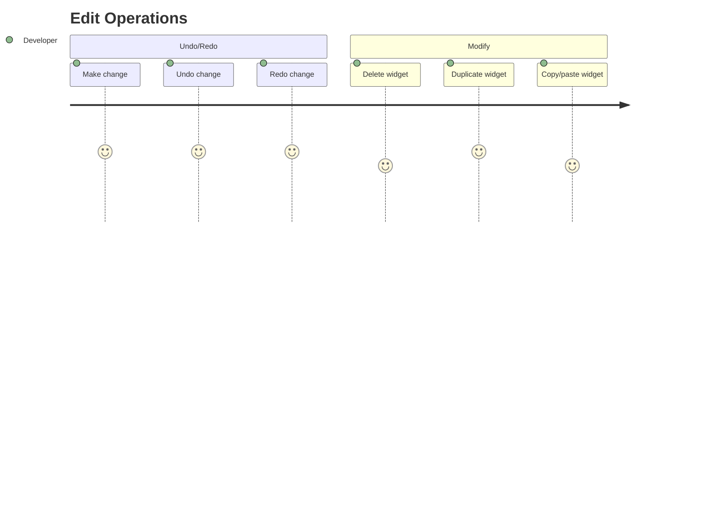

# Journey: Edit Operations

> User performs undo/redo, delete, duplicate, and copy/paste operations on widgets.

## Metadata

```yaml
actor: Pragmatic Flutter Developer
platform: desktop
locales: [en]
offline_capable: true
entry_points:
  - Keyboard shortcuts (always available)
  - Edit menu
  - Context menu (right-click)
success_metric: All edit operations undoable/redoable without data loss
priority: P1
estimated_duration: Instant per operation
related_journeys:
  - ../editor/design-canvas.md
  - ../editor/widget-tree.md
  - ../editor/properties-panel.md
last_updated: 2026-01-21
requirements: [FR7.1, FR7.2, FR7.3, FR7.4]
```

## Flow Overview



---

## Stage 1: Undo Operation

**Goal**: User reverses last action using undo

**Preconditions**:
- At least one undoable action has been performed
- Undo stack is not empty

**Flow**:
1. User performs action (add widget, change property, etc.)
2. System records action in undo stack
3. User presses Cmd/Ctrl+Z (FR7.1)
4. System reverses last action
5. Canvas updates to previous state

**Acceptance Criteria**:

```gherkin
Scenario: Undo property change
  Given Container has width 100
  And user changes width to 200
  When user presses Cmd/Ctrl+Z (FR7.1)
  Then Container width reverts to 100
  And canvas updates immediately
  And properties panel updates

Scenario: Undo widget add
  Given user added Text widget to canvas
  When user presses Cmd/Ctrl+Z
  Then Text widget is removed
  And widget tree updates
  And selection clears (if Text was selected)

Scenario: Undo widget delete
  Given user deleted Container widget
  When user presses Cmd/Ctrl+Z
  Then Container is restored
  And all its children restored
  And original position restored

Scenario: Undo move/reorder
  Given user moved widget from position A to B
  When user presses Cmd/Ctrl+Z
  Then widget returns to position A

Scenario: Undo menu option
  Given Edit menu is open
  Then Undo option shows last action: "Undo: Change width"
  When user clicks Undo
  Then same as keyboard shortcut

Scenario: Undo at limit
  Given undo stack has 100 items (limit)
  When user performs new action
  Then oldest undo item discarded
  And new action added to stack
```

**Edge Cases**:

| Trigger | System Response | User Recovery |
|---------|-----------------|---------------|
| Undo with empty stack | No action, subtle feedback | None needed |
| Undo during drag operation | Ignore until drag completes | Complete drag first |
| Undo during animation | Complete animation, then undo | None needed |
| Undo complex batch | Undo entire batch as unit | None needed |

**UX Requirements**:
- Undo response: <50ms state update
- Undo limit: 100 actions (configurable)
- Menu label: Shows action name "Undo: [action]"
- Keyboard: Cmd/Ctrl+Z (standard)

**Emotional State**: 5 - Safe to experiment, mistakes reversible

---

## Stage 2: Redo Operation

**Goal**: User restores previously undone action

**Preconditions**:
- At least one action has been undone
- Redo stack is not empty

**Flow**:
1. User has undone action(s)
2. User presses Cmd/Ctrl+Shift+Z (FR7.1)
3. System restores undone action
4. Canvas updates to reflect restoration

**Acceptance Criteria**:

```gherkin
Scenario: Redo undone change
  Given user undid width change
  When user presses Cmd/Ctrl+Shift+Z (FR7.1)
  Then width change is restored
  And canvas updates
  And properties panel updates

Scenario: Redo chain
  Given user undid 3 actions
  When user presses Cmd/Ctrl+Shift+Z three times
  Then all three actions restored in order
  And state matches before undo chain

Scenario: Redo clears on new action
  Given user undid action
  And redo is available
  When user performs new action
  Then redo stack clears
  And cannot redo undone action

Scenario: Redo menu option
  Given Edit menu is open
  And redo is available
  Then Redo option shows: "Redo: Change width"
  When clicked
  Then same as keyboard shortcut

Scenario: Redo at empty
  Given redo stack is empty
  When user presses Cmd/Ctrl+Shift+Z
  Then no action taken
  And subtle feedback (menu option grayed)
```

**Edge Cases**:

| Trigger | System Response | User Recovery |
|---------|-----------------|---------------|
| Redo with empty stack | No action, option grayed | Undo something first |
| Rapid undo/redo | Process in order | None needed |
| Redo after project save | Redo still available | None needed |

**UX Requirements**:
- Redo response: <50ms state update
- Keyboard: Cmd/Ctrl+Shift+Z (standard)
- Alternative: Cmd/Ctrl+Y on Windows
- Menu label: Shows action name

**Emotional State**: 5 - Full control over history

---

## Stage 3: Delete Widget

**Goal**: User removes widget from canvas

**Preconditions**:
- Widget is selected
- User wants to remove widget

**Flow**:
1. User selects widget on canvas or tree
2. User presses Delete or Backspace (FR7.2)
3. System removes widget from data model
4. Canvas updates without deleted widget
5. Action added to undo stack

**Acceptance Criteria**:

```gherkin
Scenario: Delete selected widget via keyboard
  Given Text widget is selected
  When user presses Delete or Backspace (FR7.2)
  Then Text widget is removed
  And widget tree updates
  And selection clears
  And action is undoable

Scenario: Delete widget with children
  Given Column widget is selected
  And Column has 3 children
  When user presses Delete
  Then Column and all children removed
  And parent (if any) re-renders
  And all removed widgets undoable as single action

Scenario: Delete via context menu
  Given widget is selected
  When user right-clicks
  And selects "Delete"
  Then widget is deleted
  Same as keyboard delete

Scenario: Delete via Edit menu
  Given widget is selected
  When user opens Edit menu
  Then "Delete" option available (with shortcut shown)
  When clicked
  Then widget is deleted

Scenario: Delete nothing selected
  Given no widget is selected
  When user presses Delete
  Then no action taken
  And no error shown
```

**Edge Cases**:

| Trigger | System Response | User Recovery |
|---------|-----------------|---------------|
| Delete root widget | Allow, canvas becomes empty | Undo if unintended |
| Delete locked widget (future) | Reject with message | Unlock first |
| Delete during drag | Ignore | Complete drag first |
| Delete multi-selection (future) | Delete all selected | Undo single action |

**UX Requirements**:
- Delete response: <50ms state update
- Keyboard: Delete or Backspace
- No confirmation for single widget (rely on undo)
- Confirmation for widget with many children (>5)

**Emotional State**: 4 - Quick cleanup, undo available

---

## Stage 4: Duplicate Widget

**Goal**: User creates copy of widget in same parent

**Preconditions**:
- Widget is selected
- Parent can accept another child

**Flow**:
1. User selects widget
2. User presses Cmd/Ctrl+D (FR7.3)
3. System creates deep copy of widget (with children)
4. System inserts copy after original
5. Copy is selected

**Acceptance Criteria**:

```gherkin
Scenario: Duplicate widget
  Given Text widget is selected in Column
  When user presses Cmd/Ctrl+D (FR7.3)
  Then Text copy created
  And copy inserted after original in Column
  And copy is selected
  And copy has new unique IDs
  And action is undoable

Scenario: Duplicate widget with children
  Given Container with nested children selected
  When user duplicates
  Then Container and all children copied
  And entire hierarchy has new IDs
  And structure preserved

Scenario: Duplicate via menu
  Given widget is selected
  When user opens Edit menu
  Then "Duplicate" option available (Cmd/Ctrl+D)
  When clicked
  Then widget duplicated

Scenario: Duplicate in single-child parent
  Given Container (single-child) has Text child
  And Text is selected
  When user attempts to duplicate
  Then error: "Cannot duplicate - parent accepts one child"
  And suggestion to wrap in Column/Row

Scenario: Duplicate via context menu
  Given widget is right-clicked
  Then context menu shows "Duplicate"
  When clicked
  Then widget duplicated
```

**Edge Cases**:

| Trigger | System Response | User Recovery |
|---------|-----------------|---------------|
| Duplicate into full parent | Error with explanation | Change parent first |
| Duplicate root widget | Create sibling root (if supported) or error | Wrap in container |
| Duplicate nothing selected | No action | Select widget first |
| Rapid duplicate | Create multiple copies | Undo extras |

**UX Requirements**:
- Duplicate response: <100ms
- Keyboard: Cmd/Ctrl+D
- New IDs: All duplicated nodes get fresh UUIDs
- Selection: New copy becomes selected

**Emotional State**: 5 - Quick iteration on design patterns

---

## Stage 5: Copy/Paste Widgets

**Goal**: User copies widgets to clipboard and pastes elsewhere

**Preconditions**:
- For copy: widget is selected
- For paste: valid paste target available

**Flow**:
1. User selects widget
2. User presses Cmd/Ctrl+C (copy) (FR7.4)
3. System serializes widget to clipboard
4. User navigates to paste target (different parent or position)
5. User presses Cmd/Ctrl+V (paste)
6. System deserializes and inserts widget

**Acceptance Criteria**:

```gherkin
Scenario: Copy widget
  Given Text widget is selected
  When user presses Cmd/Ctrl+C (FR7.4)
  Then widget serialized to clipboard
  And visual feedback: "Copied"
  And original widget unchanged

Scenario: Paste widget
  Given widget is in clipboard
  And Column is selected (paste target)
  When user presses Cmd/Ctrl+V (FR7.4)
  Then widget pasted as child of Column
  And pasted widget has new IDs
  And pasted widget is selected

Scenario: Copy/paste across projects
  Given widget copied in Project A
  When user switches to Project B
  And pastes
  Then widget appears in Project B
  And design tokens may not transfer (warning)

Scenario: Cut widget
  Given Text widget is selected
  When user presses Cmd/Ctrl+X (FR7.4)
  Then widget copied to clipboard
  And widget removed from canvas
  And action is undoable (as single "cut" action)

Scenario: Paste without target
  Given widget in clipboard
  And nothing selected
  When user presses Cmd/Ctrl+V
  Then paste at root level or canvas center
  Or prompt to select target

Scenario: Copy with children
  Given Container with children selected
  When user copies
  Then entire hierarchy copied
  When user pastes
  Then entire hierarchy pasted with new IDs
```

**Edge Cases**:

| Trigger | System Response | User Recovery |
|---------|-----------------|---------------|
| Paste into incompatible parent | Error with reason | Choose valid target |
| Paste expired clipboard (very old) | Attempt paste, may fail | Copy again |
| Paste external content | Ignore or error | Copy from FlutterForge |
| Copy nothing selected | No action | Select widget first |
| Paste with empty clipboard | No action | Copy something first |
| Paste would exceed size limit | Warning, allow anyway | Accept or cancel |

**UX Requirements**:
- Copy feedback: Brief "Copied" confirmation
- Paste location: After selected widget, or as child of selected
- Clipboard format: Internal JSON (not plain text)
- Cross-project: Supported with warnings about tokens

**Emotional State**: 4 - Efficient reuse across designs

---

## Error Scenarios

| Error Type | Trigger Condition | User Message | Recovery Action | Fallback |
|------------|-------------------|--------------|-----------------|----------|
| Undo limit | Exceeded 100 items | No message (silent) | Oldest items lost | Accept |
| Delete locked | Widget is locked | "Widget is locked" | Unlock first | None |
| Duplicate full | Parent at capacity | "Parent cannot accept more children" | Change parent | Wrap in container |
| Paste incompatible | Parent can't accept child type | "[Type] cannot be child of [Parent]" | Choose valid target | None |
| Clipboard empty | Nothing copied | No action | Copy first | None |

---

## Analytics Events

| Event Name | Trigger | Properties |
|------------|---------|------------|
| `undo_triggered` | Undo executed | `action_type`, `widget_type` |
| `redo_triggered` | Redo executed | `action_type`, `widget_type` |
| `widget_deleted` | Delete operation | `widget_type`, `had_children`, `child_count` |
| `widget_duplicated` | Duplicate operation | `widget_type`, `had_children` |
| `widget_copied` | Copy operation | `widget_type`, `had_children` |
| `widget_cut` | Cut operation | `widget_type`, `had_children` |
| `widget_pasted` | Paste operation | `widget_type`, `target_type`, `cross_project` |

---

## Technical Notes

- All operations flow through `CommandProcessor` for undo/redo
- Each command implements `execute()` and `undo()` methods
- Clipboard uses internal JSON format (not system clipboard for widgets)
- System clipboard used for copy code (different from widget copy)
- Command merging for rapid property changes (typing debounce)

---

## Command Pattern Reference

| Command | execute() | undo() |
|---------|-----------|--------|
| `AddWidgetCommand` | Insert widget into tree | Remove widget from tree |
| `DeleteWidgetCommand` | Remove widget (store copy) | Restore widget from copy |
| `PropertyChangeCommand` | Set new property value | Set old property value |
| `MoveWidgetCommand` | Update parentId and position | Restore original parent/position |
| `DuplicateWidgetCommand` | Insert copy after original | Remove copy |

---

## Validation Checklist

### Core UX
- [x] All stages have goal, preconditions, flow, acceptance criteria
- [x] Edge cases documented with recovery paths
- [x] UX requirements include specific thresholds
- [x] Error scenarios cover all edit failures
- [x] Analytics events capture edit patterns
- [x] Emotional journey tracked with 1-5 scores
- [x] Accessibility: all operations via keyboard

### Desktop-Specific
- [x] Standard keyboard shortcuts (Cmd+Z, Cmd+Shift+Z, etc.)
- [x] Edit menu with shortcuts shown
- [x] Context menu integration
- [x] Windows alternative shortcuts (Ctrl+Y for redo)

---

## Comprehensiveness Evidence

| Pass | Completed | Findings |
|------|-----------|----------|
| Edge Case Audit | Yes | Added: operations during drag, rapid actions, cross-project paste |
| ACUEPS Coverage | Yes | All stages have Performance (50ms), Error handling, Accessibility (keyboard) |
| Cross-Journey Validation | Yes | Affects canvas, tree, properties; all stay synchronized |

**Edge cases added during audit:**
- Stage 1: Undo during drag, undo at limit
- Stage 2: Redo after save, rapid undo/redo
- Stage 3: Delete locked, delete during drag
- Stage 4: Duplicate in single-child parent
- Stage 5: Cross-project paste, expired clipboard

**Cross-journey links verified:**
- Affected by: All edit actions (canvas, tree, properties)
- Affects: All views synchronized after operations
