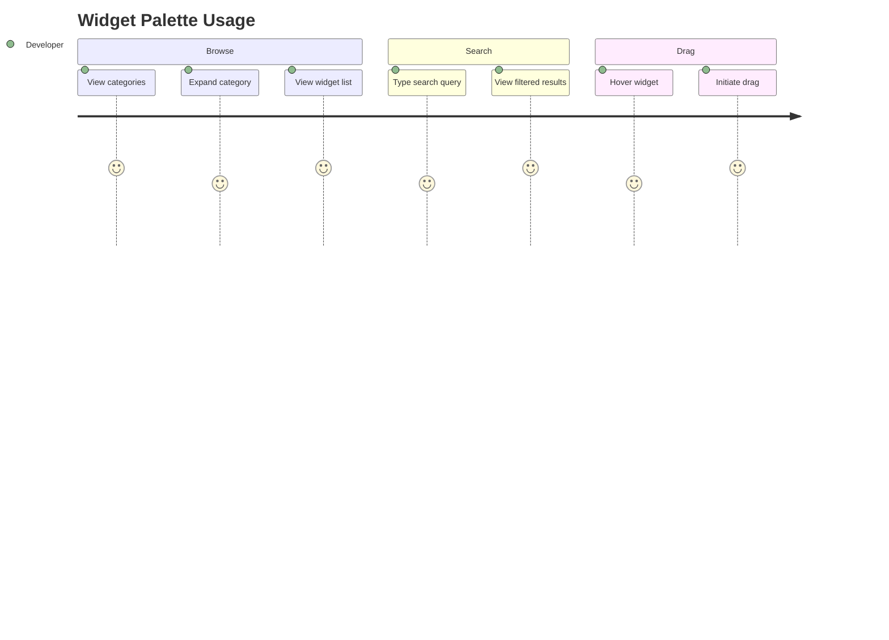

# Journey: Widget Palette

> User discovers, searches, and initiates drag of widgets from the palette to the canvas.

## Metadata

```yaml
actor: Pragmatic Flutter Developer
platform: desktop
locales: [en]
offline_capable: true
entry_points:
  - Editor workspace left panel
  - Keyboard shortcut focus (Cmd/Ctrl+1)
success_metric: Widget drag initiated within 10 seconds of search/browse
priority: P0
estimated_duration: 1-2 minutes per widget selection
related_journeys:
  - ../editor/design-canvas.md
  - ../core/first-time-export.md
last_updated: 2026-01-21
requirements: [FR1.1, FR1.2, FR1.3, FR1.4]
```

## Flow Overview



---

## Stage 1: Browse Categories

**Goal**: User views organized widget categories and locates desired widget type

**Preconditions**:
- Editor workspace is open
- Widget palette panel is visible (left side)

**Flow**:
1. User views widget palette showing categorized list (FR1.1)
2. User scans category headers: Layout, Content, Input, Scrolling, Structure
3. User clicks/expands desired category
4. System displays widgets within that category
5. User locates target widget in list

**Acceptance Criteria**:

```gherkin
Scenario: View categorized widget list
  Given the editor workspace is open
  When user views the widget palette
  Then categories are displayed: Layout, Content, Input, Scrolling, Structure (FR1.1)
  And each category is collapsible
  And widget count per category is visible

Scenario: Expand category to view widgets
  Given widget palette is visible
  When user clicks "Layout" category header
  Then Layout category expands
  And widgets display: Container, Row, Column, Stack, Expanded, Flexible, SizedBox, Padding, Center, Align, Wrap
  And each widget shows name and optional icon

Scenario: Collapse category
  Given "Layout" category is expanded
  When user clicks "Layout" header again
  Then category collapses
  And widget list hides
  And other categories remain in their state

Scenario: Keyboard category navigation
  Given palette panel has focus
  When user presses Tab or arrow keys
  Then focus moves between categories
  When user presses Enter or Space on category
  Then category expands/collapses
  And screen reader announces state change
```

**Edge Cases**:

| Trigger | System Response | User Recovery |
|---------|-----------------|---------------|
| All categories collapsed | Show "Expand All" option | Click expand all |
| Category empty (future extensibility) | Show "No widgets in category" | Browse other categories |
| Panel width too narrow | Truncate names with ellipsis, tooltip on hover | Resize panel |

**UX Requirements**:
- Category expansion: <50ms animation
- Visible focus indicator on keyboard navigation (NFR4.5)
- Minimum touch target: 44x44 for category headers (NFR4.4)

**Emotional State**: 4 - Oriented, knows where to find things

---

## Stage 2: Search and Filter

**Goal**: User quickly finds specific widget via search

**Preconditions**:
- Widget palette is visible
- User knows partial widget name

**Flow**:
1. User clicks search field or presses Cmd/Ctrl+F
2. User types search query (e.g., "text", "button")
3. System filters widgets in real-time across all categories
4. System displays matching widgets with category labels
5. User views filtered results

**Acceptance Criteria**:

```gherkin
Scenario: Search filters widgets in real-time
  Given widget palette is visible
  When user types "button" in search field
  Then results filter within 100ms (FR1.3)
  And matching widgets display: ElevatedButton, TextButton, IconButton
  And each result shows category label
  And non-matching widgets hide

Scenario: Search with partial match
  Given user types "text"
  Then results include: Text, TextField, TextButton
  And matching substring highlighted in results

Scenario: Search with no results
  Given user types "xyz123"
  Then message displays "No widgets found"
  And suggestion shows "Try: Container, Text, Button"
  And clear button visible

Scenario: Clear search
  Given search field has query "button"
  When user clicks clear button or presses Escape
  Then search field clears
  And full categorized list restores
  And focus returns to search field

Scenario: Keyboard search workflow
  Given palette has focus
  When user presses / or Cmd+F
  Then search field focuses
  When user types query
  Then results filter live
  When user presses Down arrow
  Then focus moves to first result
  When user presses Enter
  Then widget is added to canvas (or drag initiated)
```

**Edge Cases**:

| Trigger | System Response | User Recovery |
|---------|-----------------|---------------|
| Very long search query | Truncate display, search full string | Shorten query |
| Special characters in search | Escape and search literally | Use alphanumeric |
| Paste large text | Truncate to 50 chars | Type normally |

**UX Requirements**:
- Search response: <100ms filter update
- Keyboard shortcut: Cmd/Ctrl+F or / to focus search
- Clear search: X button and Escape key

**Emotional State**: 5 - Efficient, found widget quickly

---

## Stage 3: Widget Preview (Optional)

**Goal**: User previews widget appearance before dragging

**Preconditions**:
- Widget is visible in palette list
- User wants to verify appearance

**Flow**:
1. User hovers over widget in list
2. System shows preview thumbnail or tooltip (FR1.4)
3. User views widget preview with default appearance
4. User decides to drag or browse further

**Acceptance Criteria**:

```gherkin
Scenario: Hover shows widget preview
  Given widget palette shows Container
  When user hovers over Container for 300ms
  Then preview thumbnail appears (FR1.4)
  And preview shows widget with default properties
  And tooltip shows brief description

Scenario: Preview does not block dragging
  Given preview tooltip is visible
  When user initiates drag
  Then preview dismisses
  And drag operation proceeds normally

Scenario: Keyboard preview
  Given widget is focused in list
  When user presses Space (without Enter)
  Then preview/tooltip appears
  And screen reader announces widget description
```

**Edge Cases**:

| Trigger | System Response | User Recovery |
|---------|-----------------|---------------|
| Rapid hover across widgets | Debounce preview (300ms delay) | Hover and wait |
| Preview would exceed viewport | Reposition to stay visible | None needed |
| Widget has no preview image | Show text description only | Read description |

**UX Requirements**:
- Preview delay: 300ms hover before showing
- Preview dismissal: Immediate on mouse leave or drag start
- Preview position: Above or beside widget, within viewport

**Emotional State**: 4 - Informed, confident in choice

---

## Stage 4: Drag Initiation

**Goal**: User initiates drag of widget from palette toward canvas

**Preconditions**:
- Target widget is visible in palette
- Canvas is ready to receive drops

**Flow**:
1. User positions cursor over widget
2. User presses and holds mouse button
3. User moves cursor (drag threshold: 4px)
4. System initiates drag operation with visual feedback (FR1.2)
5. System shows drag preview following cursor
6. User drags toward canvas

**Acceptance Criteria**:

```gherkin
Scenario: Initiate drag from palette
  Given Container widget is visible in palette
  When user presses mouse down on Container
  And moves cursor more than 4 pixels
  Then drag operation initiates (FR1.2)
  And drag preview shows Container visual
  And cursor changes to grab/grabbing

Scenario: Drag preview follows cursor
  Given drag is in progress
  When user moves cursor
  Then drag preview follows cursor position
  And preview renders at reduced opacity (70%)

Scenario: Cancel drag before drop
  Given drag is in progress
  When user presses Escape
  Then drag cancels
  And cursor returns to normal
  And no widget added to canvas

Scenario: Drag release outside valid target
  Given drag is in progress
  When user releases outside canvas
  Then drag cancels
  And no widget added
  And palette state unchanged

Scenario: Keyboard widget placement (alternative to drag)
  Given widget is focused in palette
  When user presses Enter
  Then widget adds to canvas at center or selection point
  And widget is auto-selected
  And focus moves to canvas
```

**Edge Cases**:

| Trigger | System Response | User Recovery |
|---------|-----------------|---------------|
| Very slow drag start | Show visual feedback immediately on threshold | None needed |
| Drag while search active | Proceed with drag, keep search state | None needed |
| Multiple rapid drag attempts | Queue and process, prevent race conditions | None needed |
| Accessibility: motion sensitivity | Option to disable drag animations | Use keyboard placement |

**UX Requirements**:
- Drag threshold: 4px movement before drag initiates
- Drag feedback: <16ms cursor and preview update
- Drag preview: Semi-transparent widget representation
- Cancel: Escape key always cancels drag

**Emotional State**: 5 - In control, clear interaction model

---

## Error Scenarios

| Error Type | Trigger Condition | User Message | Recovery Action | Fallback |
|------------|-------------------|--------------|-----------------|----------|
| Search service error | Internal search failure | "Search unavailable, browse categories" | Refresh panel | Manual browse |
| Widget metadata load fail | Registry corruption | "Widget information unavailable" | Restart application | Report bug |
| Drag system failure | Platform drag API error | "Drag unavailable, use keyboard" | Use Enter to place | Keyboard workflow |

---

## Analytics Events

| Event Name | Trigger | Properties |
|------------|---------|------------|
| `palette_viewed` | Palette panel becomes visible | `visible_categories`, `timestamp` |
| `category_expanded` | Category header clicked | `category_name`, `widget_count` |
| `search_initiated` | Search field focused | `entry_method` (click/keyboard) |
| `search_query` | Search query submitted | `query`, `result_count`, `time_to_results_ms` |
| `widget_previewed` | Preview tooltip shown | `widget_type`, `hover_duration_ms` |
| `drag_initiated` | Drag operation started | `widget_type`, `source` (search/browse) |
| `keyboard_placement` | Widget added via Enter key | `widget_type` |

---

## Technical Notes

- Widget registry provides metadata including category, properties, constraints
- Search uses case-insensitive substring matching across name and aliases
- Drag uses Flutter's `Draggable` with custom feedback widget
- Preview thumbnails pre-rendered and cached at startup

---

## Validation Checklist

### Core UX
- [x] All stages have goal, preconditions, flow, acceptance criteria
- [x] Edge cases documented with recovery paths
- [x] UX requirements include specific thresholds
- [x] Error scenarios cover search, metadata, drag failures
- [x] Analytics events capture browsing and search patterns
- [x] Emotional journey tracked with 1-5 scores
- [x] Cross-referenced with related journeys
- [x] Accessibility: keyboard navigation, screen reader support

### Desktop-Specific
- [x] Keyboard shortcuts: Cmd/Ctrl+F for search, / as alternative
- [x] Drag threshold appropriate for precision input
- [x] Panel resize behavior specified
- [x] Focus management for keyboard users

---

## Comprehensiveness Evidence

| Pass | Completed | Findings |
|------|-----------|----------|
| Edge Case Audit | Yes | Added: panel resize, empty category, paste large text |
| ACUEPS Coverage | Yes | Accessibility (keyboard/screen reader), Performance (search <100ms), Usability (hover delay) |
| Cross-Journey Validation | Yes | Links to design-canvas.md (drag target), first-time-export.md (parent flow) |

**Edge cases added during audit:**
- Stage 1: Panel width narrow, all categories collapsed
- Stage 2: Special characters, paste overflow
- Stage 3: Preview viewport overflow
- Stage 4: Slow drag start, accessibility motion sensitivity

**Cross-journey links verified:**
- Incoming: Editor workspace (always visible)
- Outgoing: Design Canvas (drop target)
