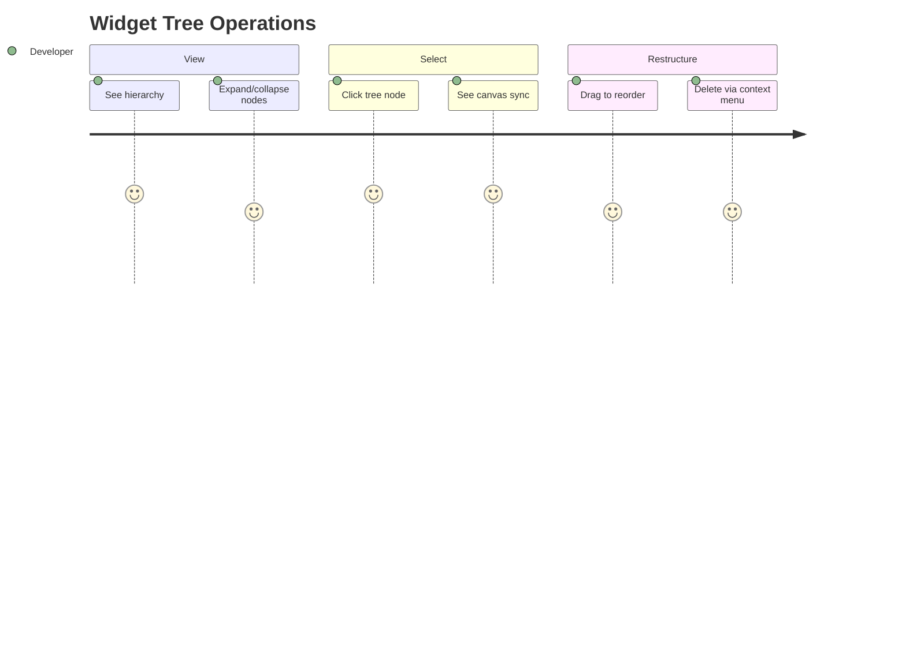

# Journey: Widget Tree Panel

> User views widget hierarchy, selects widgets via tree, reorders within parent, and deletes widgets.

## Metadata

```yaml
actor: Pragmatic Flutter Developer
platform: desktop
locales: [en]
offline_capable: true
entry_points:
  - Always visible in right panel
  - Selection from canvas syncs to tree
  - Keyboard shortcut Cmd/Ctrl+2
success_metric: User can navigate and restructure hierarchy without using canvas
priority: P0
estimated_duration: 30 seconds per tree operation
related_journeys:
  - ../editor/design-canvas.md
  - ../editor/properties-panel.md
last_updated: 2026-01-21
requirements: [FR3.1, FR3.2, FR3.3, FR3.4, FR3.5]
```

## Flow Overview



---

## Stage 1: View Hierarchy

**Goal**: User sees accurate hierarchical representation of widget tree

**Preconditions**:
- Editor workspace is open
- Canvas has at least one widget

**Flow**:
1. User views widget tree panel (FR3.1)
2. System displays root widget as top node
3. Children appear indented under parents
4. Expandable nodes show expand/collapse controls (FR3.5)
5. User scans hierarchy to understand structure

**Acceptance Criteria**:

```gherkin
Scenario: Display hierarchical tree
  Given canvas has Container > Column > [Text, Icon]
  When user views widget tree panel
  Then tree shows: (FR3.1)
    - Container (expandable)
      - Column (expandable)
        - Text
        - Icon
  And indentation clearly shows parent-child relationship

Scenario: Widget type and label display
  Given widget tree is visible
  Then each node shows:
    - Widget type icon (e.g., Container, Text)
    - Widget type name
    - Custom label if set (e.g., "Header Container")
  And text is readable at default zoom

Scenario: Expand/collapse nodes
  Given Column node has children
  When user clicks expand toggle on Column (FR3.5)
  Then Column children hide
  And toggle shows expand icon
  When user clicks again
  Then children appear
  And toggle shows collapse icon

Scenario: Expand all / Collapse all
  Given tree has multiple nested levels
  When user right-clicks on root node
  And selects "Expand All"
  Then all nested nodes expand
  When user selects "Collapse All"
  Then all nested nodes collapse to root

Scenario: Keyboard expand/collapse
  Given tree node is focused
  When user presses Right arrow
  Then node expands (if collapsed)
  When user presses Left arrow
  Then node collapses (if expanded)
  Or focus moves to parent (if leaf)
```

**Edge Cases**:

| Trigger | System Response | User Recovery |
|---------|-----------------|---------------|
| Empty canvas | Show "No widgets" placeholder | Add widget to canvas |
| Very deep nesting (>10 levels) | Horizontal scroll or truncate | Scroll or refactor |
| Long widget labels | Truncate with ellipsis, tooltip on hover | Hover for full text |
| Tree panel too narrow | Show icons only or scroll | Resize panel |

**UX Requirements**:
- Tree render: <50ms after state change
- Indentation: Clear visual hierarchy (16-20px per level)
- Node height: Minimum 28px for touch/click target

**Emotional State**: 5 - Clear understanding of structure

---

## Stage 2: Selection Sync with Canvas

**Goal**: User selects widget via tree and sees canvas update, and vice versa

**Preconditions**:
- Widget tree is visible
- Canvas has widgets

**Flow**:
1. User clicks widget node in tree
2. System updates selection state
3. Canvas shows selection overlay on corresponding widget (FR3.2)
4. Properties panel updates to show selected widget
5. Tree node shows selected state (highlight)

**Acceptance Criteria**:

```gherkin
Scenario: Select via tree
  Given tree shows Container > Text
  And canvas shows same widgets
  When user clicks Text in tree
  Then Text node highlights in tree
  And canvas selection overlay appears on Text (FR3.2)
  And properties panel shows Text properties

Scenario: Canvas selection syncs to tree
  Given user clicks widget on canvas
  Then corresponding tree node highlights (FR3.2)
  And tree scrolls to make node visible if needed
  And tree node expands parents if collapsed

Scenario: Multi-select (future consideration)
  Given user holds Cmd/Ctrl
  When user clicks multiple tree nodes
  Then all clicked nodes select
  And canvas shows multiple selection overlays
  And properties panel shows shared properties

Scenario: Keyboard navigation in tree
  Given tree panel has focus
  When user presses Up/Down arrows
  Then selection moves between visible nodes
  And canvas selection follows
  When user presses Enter
  Then focus moves to properties panel
```

**Edge Cases**:

| Trigger | System Response | User Recovery |
|---------|-----------------|---------------|
| Select collapsed node's child via canvas | Auto-expand parent in tree | None needed |
| Widget deleted while selected | Clear selection, show "No selection" | Select another widget |
| Rapid selection changes | Debounce canvas updates (50ms) | None needed |

**UX Requirements**:
- Selection sync: <16ms tree-to-canvas, <50ms canvas-to-tree
- Selected state: Clear visual distinction (background highlight)
- Scroll-into-view: Animate smoothly (150ms)

**Emotional State**: 5 - Seamless coordination between views

---

## Stage 3: Drag-to-Reorder in Tree

**Goal**: User restructures widget hierarchy by dragging in tree

**Preconditions**:
- Tree has multiple widgets
- User wants to move widget to different parent or position

**Flow**:
1. User clicks and drags widget node in tree
2. System shows drag indicator
3. User drags toward new position (FR3.3)
4. System shows insertion indicator (line between nodes)
5. User drops at new position
6. System updates data model
7. Canvas re-renders with new hierarchy

**Acceptance Criteria**:

```gherkin
Scenario: Reorder within same parent
  Given Column has children [A, B, C]
  When user drags B between A and B in tree
  Then insertion indicator appears before B
  When user drops
  Then Column children become [B, A, C] (FR3.3)
  And canvas updates immediately

Scenario: Move to different parent
  Given Row and Column are siblings
  And Text is child of Row
  When user drags Text over Column
  Then Column highlights as drop target
  When user drops
  Then Text becomes child of Column
  And Row no longer has Text
  And canvas updates

Scenario: Validation during drag
  Given user drags Expanded widget
  When drag hovers over Container (not Flex)
  Then Container does NOT highlight as valid target
  And tooltip shows "Expanded requires Row or Column"
  When drag hovers over Column
  Then Column highlights as valid target

Scenario: Cancel drag
  Given user is dragging in tree
  When user presses Escape
  Then drag cancels
  And original hierarchy preserved
```

**Edge Cases**:

| Trigger | System Response | User Recovery |
|---------|-----------------|---------------|
| Drag widget onto itself | Reject (no-op) | Drop elsewhere |
| Drag widget onto descendant | Reject circular reference | Choose valid target |
| Single-child parent already has child | Show indicator for replacement | Confirm or cancel |
| Drop at edge of viewport | Auto-scroll tree | Continue dragging |

**UX Requirements**:
- Drag threshold: 4px before drag initiates
- Insertion indicator: Clear line showing drop position
- Invalid target: Visual rejection (gray out, red border)
- Auto-scroll: When dragging near tree viewport edge

**Emotional State**: 4 - Restructuring feels natural

---

## Stage 4: Delete via Context Menu

**Goal**: User deletes widget using tree context menu

**Preconditions**:
- Widget exists in tree
- User wants to remove widget

**Flow**:
1. User right-clicks widget node in tree
2. System shows context menu (FR3.4)
3. User selects "Delete" option
4. System removes widget from data model
5. Canvas re-renders without deleted widget
6. If parent now empty, parent may collapse

**Acceptance Criteria**:

```gherkin
Scenario: Delete leaf widget
  Given Container has Text child
  When user right-clicks Text in tree
  And selects "Delete" (FR3.4)
  Then Text is removed
  And Container re-renders as empty
  And selection clears

Scenario: Delete widget with children
  Given Column has children [A, B]
  When user right-clicks Column in tree
  And selects "Delete"
  Then confirmation dialog appears: "Delete Column and 2 children?"
  When user confirms
  Then Column and all children removed
  And canvas updates

Scenario: Context menu options
  Given user right-clicks widget node
  Then context menu shows:
    - Cut (Cmd/Ctrl+X)
    - Copy (Cmd/Ctrl+C)
    - Paste (Cmd/Ctrl+V)
    - Duplicate (Cmd/Ctrl+D)
    - Delete (Delete/Backspace)
    - Wrap in... (submenu)
    - Expand All
    - Collapse All

Scenario: Delete via keyboard
  Given widget is selected
  When user presses Delete or Backspace
  Then widget is deleted (same as context menu)
  And undo is available via Cmd/Ctrl+Z

Scenario: Delete root widget
  Given only root widget exists
  When user deletes root
  Then canvas becomes empty
  And tree shows "No widgets" placeholder
```

**Edge Cases**:

| Trigger | System Response | User Recovery |
|---------|-----------------|---------------|
| Delete locked widget (future) | Reject with message | Unlock first |
| Delete while drag in progress | Ignore delete | Complete drag first |
| Delete triggers undo limit | Oldest undo discarded | Accept limitation |
| Accidental delete | Undo available | Cmd/Ctrl+Z |

**UX Requirements**:
- Context menu: <100ms to appear
- Confirmation: Only for widgets with children (>0)
- Delete animation: Fade out (150ms)

**Emotional State**: 4 - Safe restructuring with undo available

---

## Error Scenarios

| Error Type | Trigger Condition | User Message | Recovery Action | Fallback |
|------------|-------------------|--------------|-----------------|----------|
| Tree render failure | Data corruption | "Could not display tree" | Refresh panel | Restart app |
| Invalid drag target | Parent-child incompatibility | "[Widget] cannot be child of [Parent]" | Drop elsewhere | None |
| Delete locked | Widget marked as locked | "Cannot delete locked widget" | Unlock or skip | None |
| Circular reference | Drag widget onto descendant | "Cannot create circular reference" | Drop elsewhere | None |

---

## Analytics Events

| Event Name | Trigger | Properties |
|------------|---------|------------|
| `tree_node_expanded` | Expand toggle clicked | `node_type`, `depth` |
| `tree_node_collapsed` | Collapse toggle clicked | `node_type`, `depth` |
| `tree_selection` | Node clicked | `node_type`, `selection_method` |
| `tree_reorder` | Drag-drop completed | `node_type`, `old_parent`, `new_parent`, `old_index`, `new_index` |
| `tree_delete` | Widget deleted | `node_type`, `had_children`, `child_count` |
| `context_menu_opened` | Right-click on node | `node_type` |
| `context_menu_action` | Menu item selected | `action`, `node_type` |

---

## Technical Notes

- Tree uses `SliverList` for virtualization with large hierarchies
- Selection state stored in `SelectionProvider`, watched by both tree and canvas
- Drag validation checks `WidgetDefinition.canAcceptChild()` from registry
- Delete through command pattern enables undo/redo
- Context menu uses platform-native styling

---

## Validation Checklist

### Core UX
- [x] All stages have goal, preconditions, flow, acceptance criteria
- [x] Edge cases documented with recovery paths
- [x] UX requirements include specific thresholds
- [x] Error scenarios cover render, drag, delete failures
- [x] Analytics events capture tree interactions
- [x] Emotional journey tracked with 1-5 scores
- [x] Accessibility: keyboard navigation, screen reader announcements

### Desktop-Specific
- [x] Right-click context menu
- [x] Keyboard shortcuts in context menu
- [x] Arrow key navigation
- [x] Panel resize behavior

---

## Comprehensiveness Evidence

| Pass | Completed | Findings |
|------|-----------|----------|
| Edge Case Audit | Yes | Added: deep nesting scroll, narrow panel, rapid selection |
| ACUEPS Coverage | Yes | All stages have Accessibility (keyboard), Performance (50ms render), Error handling |
| Cross-Journey Validation | Yes | Bidirectional sync with canvas, selection triggers properties |

**Edge cases added during audit:**
- Stage 1: Panel too narrow, very deep nesting
- Stage 2: Collapsed parent selection, rapid changes
- Stage 3: Self-drag, descendant drag, viewport scroll
- Stage 4: Delete during drag, delete locked

**Cross-journey links verified:**
- Incoming: Canvas selection (syncs to tree)
- Outgoing: Properties Panel (selection triggers), Design Canvas (reorder updates)
