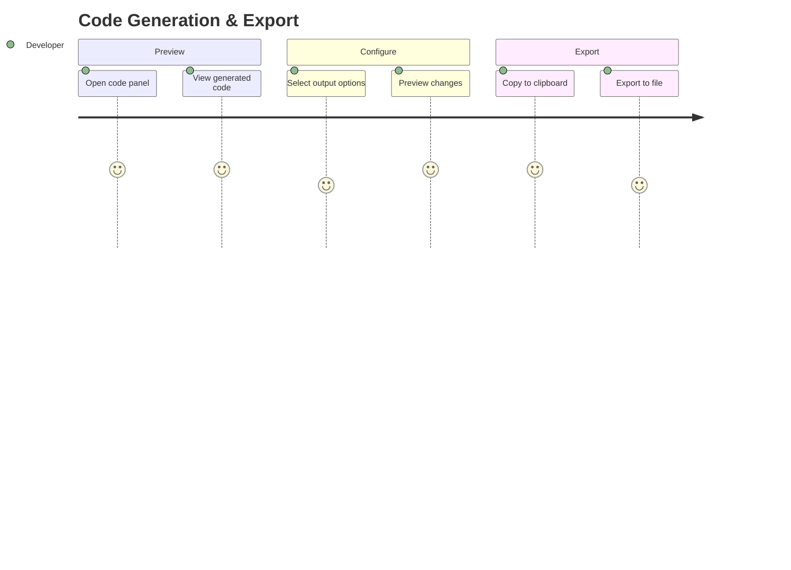

# Journey: Code Generation

> User generates clean, idiomatic Dart code from canvas design and exports via clipboard or file.

## Metadata

```yaml
actor: Pragmatic Flutter Developer
platform: desktop
locales: [en]
offline_capable: true
entry_points:
  - Code panel tab/toggle
  - Keyboard shortcut Cmd/Ctrl+E (export)
  - Menu: File > Export Code
success_metric: Generated code compiles and matches canvas design
priority: P0
estimated_duration: 30 seconds to export
related_journeys:
  - ../editor/design-canvas.md
  - ../editor/properties-panel.md
  - ../project/project-management.md
last_updated: 2026-01-21
requirements: [FR5.1, FR5.2, FR5.3, FR5.4, FR5.5, FR5.6, FR5.7, FR5.8]
```

## Flow Overview



---

## Stage 1: View Generated Code

**Goal**: User views live preview of generated Dart code

**Preconditions**:
- Canvas has at least one widget
- Code panel/tab is accessible

**Flow**:
1. User clicks Code tab or presses keyboard shortcut
2. System generates Dart code from canvas (FR5.1, FR5.2)
3. System displays code with syntax highlighting (FR5.8)
4. User reviews generated code
5. Code updates as canvas changes

**Acceptance Criteria**:

```gherkin
Scenario: View generated code for simple widget
  Given canvas has Container with Text child
  When user opens code panel
  Then valid Dart code displays (FR5.1)
  And code is formatted with dart_style (FR5.2)
  And syntax highlighting applied (FR5.8)
  And code structure matches canvas hierarchy

Scenario: Generated code quality
  Given canvas has complex nested layout
  When code generates
  Then no unnecessary nesting (clean code)
  And const used where appropriate
  And consistent naming conventions

Scenario: Live code preview updates
  Given code panel is open
  When user changes widget property on canvas
  Then code regenerates
  And changes visible in code panel within 500ms

Scenario: Generation performance
  Given canvas has 100 widgets
  When code panel opens
  Then code generates within 500ms (NFR1.2)
  And UI remains responsive during generation

Scenario: Code panel scroll sync (optional)
  Given code panel shows long file
  When user selects widget on canvas
  Then code scrolls to show selected widget's code
  And selected code section highlighted
```

**Edge Cases**:

| Trigger | System Response | User Recovery |
|---------|-----------------|---------------|
| Empty canvas | Show placeholder message | Add widgets first |
| Widget causes generation error | Show error inline with context | Fix widget config |
| Very large widget tree | Show progress indicator | Wait for completion |
| Invalid widget configuration | Generate with TODO comment | Fix configuration |

**UX Requirements**:
- Generation time: <500ms for 100 widgets (NFR1.2)
- Syntax highlighting: Dart-aware coloring
- Line numbers: Visible for reference
- Scroll position: Maintained on updates (unless tracking selection)

**Emotional State**: 5 - Core value delivered - code in hand

---

## Stage 2: Configure Output Options

**Goal**: User configures code generation settings

**Preconditions**:
- Code panel is open
- User wants to customize output

**Flow**:
1. User locates output options (toolbar or settings)
2. User selects StatelessWidget vs StatefulWidget (FR5.3, FR5.4)
3. User toggles snippet-only mode (FR5.5)
4. User sets class name if applicable
5. Code regenerates with new options

**Acceptance Criteria**:

```gherkin
Scenario: Generate StatelessWidget (default)
  Given canvas has widgets
  When code generates with default options
  Then output is StatelessWidget class (FR5.3)
  And class extends StatelessWidget
  And build method returns widget tree

Scenario: Generate StatefulWidget
  Given canvas has widgets
  When user selects StatefulWidget option (FR5.4)
  Then output includes State class
  And _WidgetNameState extends State
  And build method in State class

Scenario: Snippet-only mode
  Given user wants just widget code (not full class)
  When user enables "Snippet Only" option (FR5.5)
  Then only build method body exports
  And no class declaration included
  And imports list provided separately

Scenario: Custom class name
  Given code generates as class
  When user enters class name "MyCustomWidget"
  Then class declaration uses "MyCustomWidget"
  And State class (if StatefulWidget) uses "_MyCustomWidgetState"

Scenario: Options persist
  Given user changes output options
  When user closes and reopens project
  Then options restore to previous selection
```

**Edge Cases**:

| Trigger | System Response | User Recovery |
|---------|-----------------|---------------|
| Invalid class name | Validation error, suggest fix | Correct name |
| Reserved keyword as name | Reject with explanation | Choose different name |
| Empty class name | Use default "MyWidget" | Accept or enter name |

**UX Requirements**:
- Option toggle: Instant response
- Code regeneration: <200ms after option change
- Class name validation: Dart identifier rules
- Option persistence: Save with project

**Emotional State**: 4 - Flexible output fits workflow

---

## Stage 3: Copy to Clipboard

**Goal**: User copies generated code to system clipboard

**Preconditions**:
- Code is generated and visible
- User ready to use code in IDE

**Flow**:
1. User clicks "Copy to Clipboard" button (FR5.6)
2. System copies generated code to clipboard
3. System shows confirmation feedback
4. User pastes code in external editor/IDE

**Acceptance Criteria**:

```gherkin
Scenario: Copy code to clipboard
  Given code panel shows generated code
  When user clicks "Copy to Clipboard" button (FR5.6)
  Then code is copied to system clipboard
  And confirmation message appears for 3 seconds
  And copied code includes imports

Scenario: Copy keyboard shortcut
  Given code panel is focused
  When user presses Cmd/Ctrl+C
  Then selected code copies (or all if no selection)
  And confirmation appears

Scenario: Paste and compile
  Given code was copied
  When user pastes in Flutter project
  Then code compiles without errors (FR5.1)
  And widget renders matching canvas design

Scenario: Copy selection only
  Given user selects portion of code
  When user presses Cmd/Ctrl+C
  Then only selected code copies
  And no confirmation (standard behavior)
```

**Edge Cases**:

| Trigger | System Response | User Recovery |
|---------|-----------------|---------------|
| Clipboard access denied | Show error, offer file export | Use file export |
| Very large code | Copy may take longer | Wait for confirmation |
| Code contains errors | Warning before copy | Fix or copy anyway |

**UX Requirements**:
- Copy feedback: Toast/snackbar for 3 seconds
- Keyboard shortcut: Cmd/Ctrl+C when code focused
- Selection support: Copy all or selection

**Emotional State**: 5 - Frictionless handoff to IDE

---

## Stage 4: Export to File

**Goal**: User saves generated code to .dart file

**Preconditions**:
- Code is generated
- User wants to save to file system

**Flow**:
1. User clicks "Export to File" button (FR5.7)
2. System opens file save dialog
3. User selects location and filename
4. System writes .dart file
5. System shows success confirmation

**Acceptance Criteria**:

```gherkin
Scenario: Export to file
  Given code panel shows generated code
  When user clicks "Export to File" (FR5.7)
  Then native file save dialog opens
  And default filename is class name or "my_widget.dart"
  And filter shows .dart files

Scenario: Successful file save
  Given user selects save location
  And enters filename "home_screen.dart"
  When user confirms save
  Then file is written to selected location
  And success message appears
  And file contains generated code with imports

Scenario: Export keyboard shortcut
  Given code panel is visible
  When user presses Cmd/Ctrl+Shift+E
  Then export dialog opens

Scenario: Overwrite existing file
  Given filename already exists at location
  When user confirms save
  Then confirmation dialog "Overwrite existing file?"
  When user confirms overwrite
  Then file is replaced
```

**Edge Cases**:

| Trigger | System Response | User Recovery |
|---------|-----------------|---------------|
| Permission denied | Show error with path | Choose accessible location |
| Invalid filename | Validation error | Correct filename |
| Disk full | Show error | Free space or choose other location |
| Export cancelled | No file written | None needed |
| Export to read-only location | Error message | Choose writable location |

**UX Requirements**:
- File dialog: Native platform dialog
- Default filename: Smart default based on class name
- File extension: Always .dart
- Success feedback: Clear confirmation

**Emotional State**: 5 - Complete handoff, file ready

---

## Stage 5: Code Validation

**Goal**: User verifies generated code compiles correctly

**Preconditions**:
- Code has been exported or copied
- User wants to validate

**Flow**:
1. User pastes code in Flutter project
2. IDE performs analysis
3. Code compiles without errors
4. Widget renders matching canvas

**Acceptance Criteria**:

```gherkin
Scenario: Generated code compiles
  Given user exports code to Flutter project
  When IDE analyzes code
  Then no compilation errors occur
  And no analysis warnings (or minimal)
  And imports resolve correctly

Scenario: Code matches design
  Given code is compiled and run
  Then rendered widget matches canvas design
  And layout behavior identical
  And properties accurately reflected

Scenario: Code quality standards met
  Given code is generated
  Then dart_style formatting applied (FR5.2)
  And const used for constant expressions
  And no unnecessary builders or callbacks
  And indentation consistent
```

**Edge Cases**:

| Trigger | System Response | User Recovery |
|---------|-----------------|---------------|
| Missing import | Include all required imports | N/A (should be included) |
| Widget requires package | Include dependency comment | User adds to pubspec |
| Deprecated widget | Use current API | N/A (use current) |

**UX Requirements**:
- Import completeness: All needed imports included
- Code formatting: Consistent with dart_style
- Quality: Would pass very_good_analysis lint rules

**Emotional State**: 5 - Confidence in generated code

---

## Error Scenarios

| Error Type | Trigger Condition | User Message | Recovery Action | Fallback |
|------------|-------------------|--------------|-----------------|----------|
| Generation failure | Widget tree invalid | "Could not generate code for [widget]" | Highlight problem widget | Show partial code |
| Clipboard denied | System permission | "Cannot access clipboard" | Use file export | File export |
| File write failure | Permission/disk | "Could not save file: [reason]" | Choose different location | Copy to clipboard |
| Format failure | dart_style error | "Code formatting failed" | Show unformatted | Unformatted output |

---

## Analytics Events

| Event Name | Trigger | Properties |
|------------|---------|------------|
| `code_panel_opened` | Panel becomes visible | `widget_count`, `generation_time_ms` |
| `code_option_changed` | Output option toggled | `option`, `new_value` |
| `code_copied` | Clipboard copy | `line_count`, `widget_count` |
| `code_exported` | File exported | `file_size`, `line_count`, `widget_count` |
| `code_generation_error` | Generation failed | `error_type`, `widget_type` |

---

## Technical Notes

- Code generation uses `code_builder` for AST-based output
- `DartEmitter.scoped()` handles import name collision
- `DartFormatter` from dart_style package for formatting
- Generation runs async to prevent UI blocking
- Widget-to-code mapping maintained for selection sync

---

## Generated Code Example

```dart
import 'package:flutter/material.dart';

class MyWidget extends StatelessWidget {
  const MyWidget({super.key});

  @override
  Widget build(BuildContext context) {
    return Container(
      width: 200,
      padding: const EdgeInsets.all(16),
      color: Colors.blue,
      child: const Column(
        children: [
          Text('Hello'),
          Icon(Icons.star),
        ],
      ),
    );
  }
}
```

---

## Validation Checklist

### Core UX
- [x] All stages have goal, preconditions, flow, acceptance criteria
- [x] Edge cases documented with recovery paths
- [x] UX requirements include specific thresholds (500ms generation)
- [x] Error scenarios cover generation, clipboard, file failures
- [x] Analytics events capture export patterns
- [x] Emotional journey tracked with 1-5 scores
- [x] Accessibility: keyboard shortcuts, focus management

### Desktop-Specific
- [x] Native file dialogs
- [x] Keyboard shortcuts for copy/export
- [x] Menu integration (File > Export)
- [x] Multi-monitor dialog positioning

---

## Comprehensiveness Evidence

| Pass | Completed | Findings |
|------|-----------|----------|
| Edge Case Audit | Yes | Added: clipboard denial, permission errors, format failure |
| ACUEPS Coverage | Yes | All stages have Performance (500ms), Error handling, Security (file permissions) |
| Cross-Journey Validation | Yes | Canvas/properties changes trigger regeneration, project management saves options |

**Edge cases added during audit:**
- Stage 1: Empty canvas, generation error, large widget tree
- Stage 2: Invalid class name, reserved keywords
- Stage 3: Clipboard access denied, large code
- Stage 4: Permission denied, overwrite confirmation
- Stage 5: Missing imports, deprecated widgets

**Cross-journey links verified:**
- Incoming: Canvas changes, Properties changes (trigger regeneration)
- Outgoing: External IDE (code handoff)
