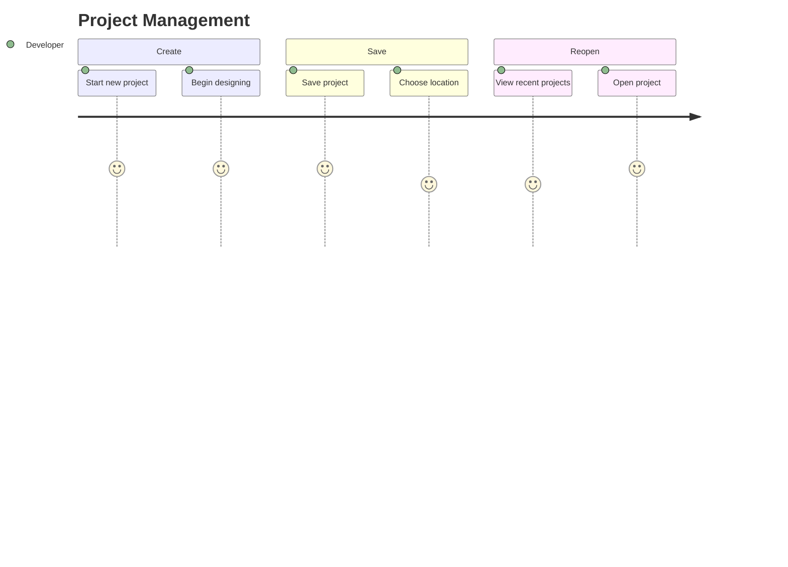

# Journey: Project Management

> User creates, saves, opens, and manages FlutterForge projects.

## Metadata

```yaml
actor: Pragmatic Flutter Developer
platform: desktop
locales: [en]
offline_capable: true
entry_points:
  - Application launch (new/open)
  - Menu: File > New/Open/Save
  - Recent projects list
success_metric: Project saved and reopened with identical state
priority: P1
estimated_duration: 30 seconds per operation
related_journeys:
  - ../core/first-time-export.md
  - ../editor/design-canvas.md
last_updated: 2026-01-21
requirements: [FR6.1, FR6.2, FR6.3, FR6.4, FR6.5]
```

## Flow Overview



---

## Stage 1: Create New Project

**Goal**: User starts a new design project with empty canvas

**Preconditions**:
- FlutterForge is running
- User wants to start fresh design

**Flow**:
1. User selects File > New Project or clicks "New" button
2. System prompts for project name (optional)
3. User enters name or accepts default
4. System creates new project in memory
5. System displays empty canvas ready for design

**Acceptance Criteria**:

```gherkin
Scenario: Create new project from menu
  Given FlutterForge is running
  When user selects File > New Project
  Then new project dialog appears
  And default name suggested (e.g., "Untitled Project")
  When user confirms
  Then empty canvas displays
  And widget palette ready for drag

Scenario: Create new project with existing unsaved work
  Given user has unsaved changes
  When user selects File > New Project
  Then confirmation dialog appears: "Save current project?"
  And options: Save, Don't Save, Cancel
  When user chooses action
  Then appropriate action taken before creating new

Scenario: New project keyboard shortcut
  Given FlutterForge is running
  When user presses Cmd/Ctrl+N
  Then new project flow begins

Scenario: Project defaults
  Given new project is created
  Then project has default name
  And canvas is empty (no widgets)
  And design tokens empty or default theme
  And undo history empty
```

**Edge Cases**:

| Trigger | System Response | User Recovery |
|---------|-----------------|---------------|
| Create while exporting | Block until export complete | Wait |
| Invalid project name | Validation error | Correct name |
| Name too long (>100 chars) | Truncate with warning | Accept or shorten |

**UX Requirements**:
- New project dialog: Simple, focused
- Keyboard shortcut: Cmd/Ctrl+N
- Unsaved work protection: Always prompt

**Emotional State**: 5 - Fresh start, ready to create

---

## Stage 2: Save Project

**Goal**: User saves current project to local file system

**Preconditions**:
- Project exists with design work
- User wants to persist work

**Flow**:
1. User selects File > Save or presses Cmd/Ctrl+S
2. If new project (never saved): File dialog opens (FR6.1)
3. User selects location and filename
4. System serializes project to .forge file (FR6.1)
5. System shows save confirmation
6. Title bar shows project name

**Acceptance Criteria**:

```gherkin
Scenario: Save new project (Save As)
  Given project has never been saved
  When user presses Cmd/Ctrl+S
  Then file save dialog opens
  And default filename is project name + ".forge"
  When user confirms location
  Then project saves to .forge file (FR6.1)
  And confirmation appears
  And title bar shows filename

Scenario: Save existing project
  Given project was previously saved
  When user presses Cmd/Ctrl+S
  Then project saves to same location
  And no dialog needed
  And brief confirmation appears

Scenario: Save As (new location)
  Given project exists (saved or not)
  When user selects File > Save As
  Then file save dialog opens
  And user can choose new location/name
  When confirmed
  Then project saves to new location
  And title bar updates

Scenario: Project file format
  Given project is saved
  Then .forge file is created (ZIP archive)
  And contains: manifest.json, project.json, assets/
  And file size proportional to content

Scenario: Save keyboard shortcut
  Given project has unsaved changes
  When user presses Cmd/Ctrl+S
  Then save operation begins
  And Cmd/Ctrl+Shift+S opens Save As
```

**Edge Cases**:

| Trigger | System Response | User Recovery |
|---------|-----------------|---------------|
| Permission denied | Error with path info | Choose accessible location |
| Disk full | Error message | Free space or choose other disk |
| Save during generation | Queue save for after generation | None needed |
| File already exists (Save As) | Confirm overwrite | Confirm or rename |
| Network drive slow | Show progress indicator | Wait |

**UX Requirements**:
- Save response: <500ms for typical project
- Save indicator: Brief "Saved" confirmation
- Title bar: Shows filename and unsaved indicator (*)
- Native dialog: Platform file picker

**Emotional State**: 5 - Work is safe

---

## Stage 3: Open Existing Project

**Goal**: User opens previously saved project

**Preconditions**:
- .forge file exists on file system
- User wants to continue work

**Flow**:
1. User selects File > Open or presses Cmd/Ctrl+O
2. System shows file open dialog (FR6.2)
3. User navigates to and selects .forge file
4. System loads and deserializes project
5. Canvas displays loaded design
6. All panels update with project state

**Acceptance Criteria**:

```gherkin
Scenario: Open project from file dialog
  Given .forge file exists
  When user selects File > Open
  Then file open dialog appears (FR6.2)
  And filter shows .forge files only
  When user selects file and confirms
  Then project loads
  And canvas shows saved design
  And widget tree shows hierarchy
  And title bar shows filename

Scenario: Open with unsaved changes
  Given current project has unsaved changes
  When user attempts to open another project
  Then confirmation dialog: "Save current project?"
  And user can save, discard, or cancel

Scenario: Open corrupted file
  Given .forge file is corrupted
  When user attempts to open
  Then error dialog: "Could not open project: invalid format"
  And offer to contact support
  And current project unchanged

Scenario: Open keyboard shortcut
  Given FlutterForge is running
  When user presses Cmd/Ctrl+O
  Then file open dialog appears

Scenario: Project state restored completely
  Given project with complex state saved
  When project is reopened
  Then widget hierarchy identical
  And all properties preserved
  And design tokens preserved
  And output settings preserved
  And zoom/pan position restored (optional)
```

**Edge Cases**:

| Trigger | System Response | User Recovery |
|---------|-----------------|---------------|
| File not found | Error message | Locate file |
| Wrong file type | Error: "Not a valid .forge file" | Select correct file |
| Old version format | Migrate or error | Depends on version |
| File locked by another process | Error message | Close other process |
| Very large file (>100MB) | Progress indicator during load | Wait |

**UX Requirements**:
- Load time: <2 seconds for typical project
- Progress indicator: For files >10MB
- Error handling: Clear messages with recovery options
- File filter: Show only .forge files by default

**Emotional State**: 4 - Continuing previous work

---

## Stage 4: Recent Projects

**Goal**: User quickly accesses recently worked-on projects

**Preconditions**:
- User has previously saved projects
- User wants quick access

**Flow**:
1. User opens File menu or welcome screen
2. System displays recent projects list (FR6.3)
3. User clicks project in list
4. System opens project (same as Stage 3)

**Acceptance Criteria**:

```gherkin
Scenario: View recent projects in menu
  Given user has opened projects before
  When user opens File menu
  Then "Recent Projects" submenu appears (FR6.3)
  And shows up to 10 recent projects
  And each shows name and path
  And "Clear Recent" option available

Scenario: View recent projects on welcome screen
  Given FlutterForge launches
  And user has recent projects
  Then welcome screen shows recent projects list
  And each shows name, last modified, thumbnail (optional)
  When user clicks project
  Then project opens

Scenario: Open recent project
  Given recent projects list is visible
  When user clicks project name
  Then project opens
  And same behavior as File > Open

Scenario: Recent project file moved/deleted
  Given project in recent list no longer exists at path
  When user clicks to open
  Then error: "Project not found at [path]"
  And option to locate file or remove from list

Scenario: Clear recent projects
  Given recent projects list has items
  When user selects "Clear Recent Projects"
  Then confirmation dialog appears
  When confirmed
  Then recent list empties
  And no project data affected
```

**Edge Cases**:

| Trigger | System Response | User Recovery |
|---------|-----------------|---------------|
| Recent project moved | "File not found", offer locate | Locate or remove |
| Recent project corrupted | Same as Stage 3 corrupted | Remove from list |
| No recent projects | Show empty state message | Use File > Open |
| List exceeds limit (10) | Oldest removed automatically | None needed |

**UX Requirements**:
- Recent list: Maximum 10 items
- Display: Name + path (truncated if long)
- Welcome screen: Quick access without menu
- Persistence: Recent list survives app restart

**Emotional State**: 5 - Quick access to previous work

---

## Stage 5: Auto-Save and Recovery

**Goal**: System protects work via auto-save and crash recovery

**Preconditions**:
- User is working on project
- System auto-save enabled (default)

**Flow**:
1. User makes changes to project
2. System auto-saves periodically (FR6.4)
3. If crash occurs, recovery data exists
4. On next launch, system offers recovery
5. User can restore or discard recovery

**Acceptance Criteria**:

```gherkin
Scenario: Auto-save during work
  Given user is editing project
  And auto-save is enabled
  Then system saves recovery data every 60 seconds (FR6.4)
  And recovery data saved to separate location
  And auto-save does not interrupt workflow

Scenario: Recovery after crash
  Given application crashed with unsaved changes
  When user relaunches FlutterForge
  Then recovery dialog appears: "Recover unsaved changes?"
  And shows project name and last auto-save time
  When user clicks "Recover"
  Then project opens with recovered state
  And user can save to finalize

Scenario: Discard recovery
  Given recovery is available
  When user clicks "Discard"
  Then recovery data deleted
  And normal launch proceeds

Scenario: Recovery data cleanup
  Given user successfully saves project
  Then corresponding recovery data deleted
  And no stale recovery data accumulates

Scenario: Auto-save disable option
  Given user prefers no auto-save
  When user disables in settings
  Then auto-save stops
  And user responsible for manual saves
```

**Edge Cases**:

| Trigger | System Response | User Recovery |
|---------|-----------------|---------------|
| Recovery data corrupted | Skip recovery, notify user | Accept data loss |
| Multiple recovery files | Show list to choose from | Select most recent |
| Disk full during auto-save | Warn user, continue working | Free space, manual save |
| Recovery conflicts with current | Clear dialog about options | Choose one |

**UX Requirements**:
- Auto-save interval: 60 seconds (configurable)
- Auto-save indicator: Brief, non-intrusive
- Recovery dialog: Clear options on launch
- Storage location: OS-appropriate cache/temp directory

**Emotional State**: 5 - Work protected automatically

---

## Stage 6: Multiple Screens (Future/P1)

**Goal**: User manages multiple screens within single project

**Preconditions**:
- Project open
- User wants multiple distinct layouts

**Flow**:
1. User creates new screen within project (FR6.5)
2. System adds screen to project
3. User switches between screens
4. Each screen has independent widget tree
5. All screens saved together in project

**Acceptance Criteria**:

```gherkin
Scenario: Create new screen
  Given project is open
  When user selects "Add Screen" (FR6.5)
  Then new screen created with empty canvas
  And screen appears in screens list
  And screen has default name ("Screen 2")

Scenario: Switch between screens
  Given project has multiple screens
  When user clicks screen in list
  Then canvas shows that screen's content
  And widget tree updates
  And properties panel updates

Scenario: Rename screen
  Given screen exists
  When user double-clicks screen name
  Then inline editor appears
  When user enters new name
  Then screen renames

Scenario: Delete screen
  Given project has multiple screens
  When user deletes screen
  Then confirmation if screen has content
  When confirmed
  Then screen removed
  And cannot delete last screen

Scenario: Export specific screen
  Given project has multiple screens
  When user opens code export
  Then option to export current screen or all screens
  When user selects specific screen
  Then only that screen's code exports
```

**Edge Cases**:

| Trigger | System Response | User Recovery |
|---------|-----------------|---------------|
| Delete only screen | Disable delete, show message | Add another first |
| Duplicate screen names | Allow with warning | Rename |
| Very many screens (>20) | Performance warning | Consider splitting project |

**UX Requirements**:
- Screen list: Visible in sidebar or tabs
- Screen thumbnail: Preview of screen content (optional)
- Screen limit: Soft limit of 20 with warning

**Emotional State**: 4 - Complex projects organized

---

## Error Scenarios

| Error Type | Trigger Condition | User Message | Recovery Action | Fallback |
|------------|-------------------|--------------|-----------------|----------|
| Save permission | Cannot write to location | "Cannot save to this location" | Choose different location | None |
| Load corruption | Invalid .forge file | "Project file corrupted" | Contact support | Open different file |
| Disk full | No space for save | "Disk full - cannot save" | Free space | Save elsewhere |
| Recovery failure | Cannot read recovery | "Could not recover. Sorry." | Acknowledge | Start fresh |
| Version mismatch | Old file format | "Project from older version" | Attempt migration | None |

---

## Analytics Events

| Event Name | Trigger | Properties |
|------------|---------|------------|
| `project_created` | New project started | `method` (menu/shortcut/welcome) |
| `project_saved` | Project saved | `is_first_save`, `file_size`, `widget_count` |
| `project_opened` | Project loaded | `source` (dialog/recent), `load_time_ms`, `widget_count` |
| `recent_project_accessed` | Recent item clicked | `list_position` |
| `auto_save_triggered` | Auto-save executed | `widget_count`, `time_since_last_edit` |
| `recovery_offered` | Recovery dialog shown | `time_since_crash` |
| `recovery_action` | User chose recover/discard | `action` |

---

## File Format Details

```
project.forge (ZIP archive)
├── manifest.json       # Version, metadata, compatibility
├── project.json        # Serialized ForgeProject
│   ├── screens[]       # Array of screen definitions
│   ├── designTokens[]  # Design system tokens
│   └── metadata        # Project settings
└── assets/
    ├── images/         # Embedded images (future)
    └── fonts/          # Custom fonts (future)
```

---

## Technical Notes

- .forge file uses ZIP compression for bundling
- Project serialization via Freezed JSON support
- Security-scoped bookmarks on macOS for recent files
- Auto-save uses separate temp directory
- File watching detects external changes (optional)

---

## Validation Checklist

### Core UX
- [x] All stages have goal, preconditions, flow, acceptance criteria
- [x] Edge cases documented with recovery paths
- [x] UX requirements include specific thresholds
- [x] Error scenarios cover save, load, recovery failures
- [x] Analytics events capture project lifecycle
- [x] Emotional journey tracked with 1-5 scores
- [x] Accessibility: keyboard shortcuts for all actions

### Desktop-Specific
- [x] Native file dialogs
- [x] Keyboard shortcuts (Cmd+N/O/S)
- [x] Menu integration (File menu)
- [x] Title bar state (filename, unsaved indicator)
- [x] Recent files integration

---

## Comprehensiveness Evidence

| Pass | Completed | Findings |
|------|-----------|----------|
| Edge Case Audit | Yes | Added: network drive, version mismatch, multiple recovery |
| ACUEPS Coverage | Yes | All stages have Security (permissions), Error handling, Performance (load times) |
| Cross-Journey Validation | Yes | Links to first-time-export (entry), design-canvas (content) |

**Edge cases added during audit:**
- Stage 1: Create during export, name validation
- Stage 2: Network drive slow, locked file
- Stage 3: Wrong file type, old version format
- Stage 4: Recent moved/deleted, list limit
- Stage 5: Disk full during auto-save, multiple recovery
- Stage 6: Delete only screen, many screens

**Cross-journey links verified:**
- Incoming: First launch (entry), Menu (always available)
- Outgoing: Design Canvas (loaded content), Code Generation (export settings persist)
