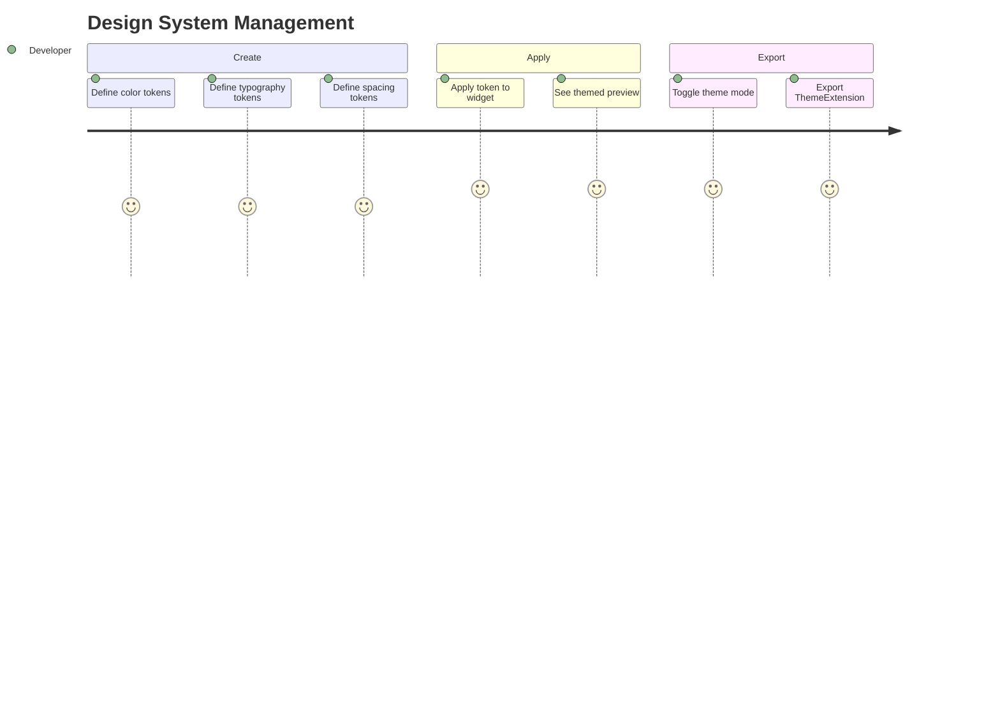

# Journey: Design System Manager

> User creates design tokens, applies them to widgets, and exports as ThemeExtension.

## Metadata

```yaml
actor: Pragmatic Flutter Developer
platform: desktop
locales: [en]
offline_capable: true
entry_points:
  - Design System panel/tab
  - Keyboard shortcut Cmd/Ctrl+4
  - Theme toggle in toolbar
success_metric: Consistent theming applied across all widgets in design
priority: P1
estimated_duration: 5-10 minutes for initial setup, seconds per token change
related_journeys:
  - ../editor/design-canvas.md
  - ../editor/properties-panel.md
  - ../export/code-generation.md
last_updated: 2026-01-21
requirements: [FR8.1, FR8.2, FR8.3, FR8.4, FR8.5]
```

## Flow Overview



---

## Stage 1: Create Design Tokens

**Goal**: User defines reusable design tokens for colors, typography, spacing, radii

**Preconditions**:
- Project is open
- Design System panel is accessible

**Flow**:
1. User opens Design System panel (FR8.1)
2. User selects token category (Colors, Typography, Spacing, Radii)
3. User clicks "Add Token" button
4. User defines token name and value(s)
5. System saves token to project

**Acceptance Criteria**:

```gherkin
Scenario: Create color token
  Given Design System panel is open
  And Colors category selected
  When user clicks "Add Color Token"
  Then new token form appears
  And fields: name, light value, dark value
  When user enters name "primaryBrand" and selects blue
  Then token creates with both light and dark values (FR8.1)
  And token appears in Colors list

Scenario: Create typography token
  Given Typography category selected
  When user adds token
  Then fields: name, fontFamily, fontSize, fontWeight, lineHeight
  When user defines "headingLarge" with values
  Then token creates
  And can be applied to Text widgets

Scenario: Create spacing token
  Given Spacing category selected
  When user adds token
  Then fields: name, value (double)
  When user defines "spacingMedium" as 16
  Then token creates
  And can be used for padding/margin values

Scenario: Create radius token
  Given Radii category selected
  When user adds token
  Then fields: name, value (double)
  When user defines "radiusSmall" as 4
  Then token creates
  And can be used for border radius

Scenario: Token naming validation
  Given user is creating token
  When user enters invalid name (spaces, special chars)
  Then validation error shows
  And suggests valid format (camelCase)
```

**Edge Cases**:

| Trigger | System Response | User Recovery |
|---------|-----------------|---------------|
| Duplicate token name | Error: "Token already exists" | Choose different name |
| Empty token name | Validation error | Enter name |
| Invalid color value | Show color picker for correction | Use picker |
| Very many tokens (>100) | Performance warning | Consider cleanup |

**UX Requirements**:
- Token creation: <100ms to save
- Token categories: Colors, Typography, Spacing, Radii
- Token form: Inline or modal, quick to complete
- Name format: camelCase suggested, validated

**Emotional State**: 4 - Setting up consistent design foundation

---

## Stage 2: Semantic Aliasing

**Goal**: User creates semantic names referencing base tokens

**Preconditions**:
- Base tokens exist (e.g., blue-500, gray-100)
- User wants semantic naming

**Flow**:
1. User views existing tokens
2. User creates alias token (FR8.2)
3. User sets alias to reference base token
4. Alias resolves to base token value
5. Changes to base propagate to aliases

**Acceptance Criteria**:

```gherkin
Scenario: Create semantic alias
  Given color token "blue-500" exists with value #3B82F6
  When user creates new token "primaryBrand" (FR8.2)
  And sets type to "Alias"
  And selects "blue-500" as reference
  Then "primaryBrand" resolves to #3B82F6
  And displays as alias in token list

Scenario: Alias updates when base changes
  Given "primaryBrand" aliases "blue-500"
  When user changes "blue-500" to #2563EB
  Then "primaryBrand" automatically reflects new value
  And all widgets using "primaryBrand" update

Scenario: Break alias to standalone
  Given "primaryBrand" aliases "blue-500"
  When user clicks "Convert to Value"
  Then "primaryBrand" becomes standalone
  And holds current resolved value
  And no longer updates with base

Scenario: View alias chain
  Given token has alias
  Then token shows reference indicator
  And tooltip shows: "Aliases: blue-500 -> #3B82F6"
  And can navigate to base token
```

**Edge Cases**:

| Trigger | System Response | User Recovery |
|---------|-----------------|---------------|
| Circular alias reference | Error: "Cannot create circular reference" | Choose different base |
| Delete aliased token | Warning about dependent aliases | Confirm or convert aliases |
| Deep alias chain (>3 levels) | Warning about complexity | Flatten chain |

**UX Requirements**:
- Alias creation: Clear UI distinguishing alias from value
- Alias resolution: Instant propagation
- Alias indicator: Visual marker showing token is alias

**Emotional State**: 4 - Organized token hierarchy

---

## Stage 3: Theme Mode Toggle

**Goal**: User previews design in Light, Dark, and High-Contrast modes

**Preconditions**:
- Tokens have light and dark values
- Canvas has widgets using tokens

**Flow**:
1. User locates theme toggle in toolbar or panel (FR8.3)
2. User switches between Light / Dark / High-Contrast
3. Canvas immediately reflects chosen theme
4. All token-based colors update

**Acceptance Criteria**:

```gherkin
Scenario: Switch to Dark mode
  Given canvas has widgets with color tokens
  And theme is Light
  When user clicks Dark mode toggle (FR8.3)
  Then canvas background changes
  And all token-based colors switch to dark values
  And preview updates within 16ms

Scenario: Switch to High-Contrast mode
  Given user selects High-Contrast
  Then colors adjust for accessibility
  And contrast ratios increase
  And canvas reflects changes

Scenario: Non-token colors unchanged
  Given widget has hardcoded color (not token)
  When user switches theme mode
  Then hardcoded color unchanged
  And warning indicator optional

Scenario: Theme toggle persistence
  Given user sets theme to Dark
  When user saves and reopens project
  Then theme mode restores to Dark
  And design tokens remember mode selection

Scenario: Toggle via keyboard
  Given user has focus in canvas
  When user presses Cmd/Ctrl+Shift+T
  Then theme cycles: Light -> Dark -> High-Contrast -> Light
```

**Edge Cases**:

| Trigger | System Response | User Recovery |
|---------|-----------------|---------------|
| Token missing dark value | Use light value with warning | Define dark value |
| Toggle during animation | Complete animation, then switch | None needed |
| Export reflects current theme | Warning if exporting single theme | Choose or export all |

**UX Requirements**:
- Theme switch: <16ms visual update
- Toggle location: Toolbar (prominent) or panel
- Keyboard: Cmd/Ctrl+Shift+T to cycle
- Visual indicator: Current mode clearly shown

**Emotional State**: 5 - Instant theme visualization

---

## Stage 4: Apply Tokens to Widgets

**Goal**: User applies design tokens to widget properties

**Preconditions**:
- Tokens are defined
- Widget is selected
- Property supports token type

**Flow**:
1. User selects widget
2. User opens property that supports tokens (e.g., color)
3. User clicks "Use Token" or token picker
4. User selects token from list
5. Property binds to token
6. Canvas updates with token value

**Acceptance Criteria**:

```gherkin
Scenario: Apply color token to widget
  Given Container is selected
  And "primaryBrand" color token exists
  When user clicks color property
  And selects "Use Token"
  And chooses "primaryBrand"
  Then Container color binds to primaryBrand
  And canvas shows token's current value
  And property field shows token name

Scenario: Token vs literal value indicator
  Given property has token applied
  Then property field shows token icon
  And displays token name instead of raw value
  And tooltip shows resolved value

Scenario: Change token value affects widgets
  Given Container uses "primaryBrand"
  And "primaryBrand" is blue
  When user changes "primaryBrand" to green
  Then Container on canvas turns green
  And all widgets using token update

Scenario: Clear token binding
  Given property uses token
  When user clicks "Clear Token" or enters literal value
  Then property becomes literal
  And no longer follows token changes

Scenario: Apply spacing token
  Given Container selected
  And "spacingMedium" = 16 exists
  When user applies to padding property
  Then padding uses token value
  And changes with token
```

**Edge Cases**:

| Trigger | System Response | User Recovery |
|---------|-----------------|---------------|
| Token deleted while in use | Widgets show warning, fallback value | Create replacement token |
| Wrong token type for property | Token not shown in picker | Use correct type |
| Token value causes overflow | Show overflow indicator | Adjust token or widget |

**UX Requirements**:
- Token picker: Filtered by compatible type
- Token binding: Clear visual distinction from literal
- Propagation: Instant update on token change
- Search: Token picker supports search

**Emotional State**: 5 - Consistent design with single source of truth

---

## Stage 5: Reusable Style Presets

**Goal**: User creates and applies style presets combining multiple tokens

**Preconditions**:
- Tokens are defined
- User wants to bundle commonly used styles

**Flow**:
1. User opens Presets section (FR8.4)
2. User creates preset (e.g., "PrimaryButton")
3. User defines properties: color, textStyle, borderRadius
4. User applies preset to widget
5. Widget receives all preset properties

**Acceptance Criteria**:

```gherkin
Scenario: Create style preset
  Given design tokens exist
  When user creates preset "PrimaryButtonStyle" (FR8.4)
  Then preset form allows setting:
    - backgroundColor: token or value
    - foregroundColor: token or value
    - borderRadius: token or value
    - padding: token or value
  When saved
  Then preset appears in Presets list

Scenario: Apply preset to widget
  Given "PrimaryButtonStyle" preset exists
  And ElevatedButton is selected
  When user applies preset
  Then all preset properties apply to widget
  And widget reflects combined styling

Scenario: Edit preset updates widgets
  Given widgets use "PrimaryButtonStyle"
  When user edits preset's backgroundColor
  Then all widgets using preset update

Scenario: Override individual property
  Given widget uses preset
  When user manually changes one property
  Then that property becomes override
  And other preset properties remain bound
  And override indicated visually

Scenario: Delete preset
  Given preset is in use
  When user deletes preset
  Then widgets retain current values
  But become unlinked from preset
```

**Edge Cases**:

| Trigger | System Response | User Recovery |
|---------|-----------------|---------------|
| Preset has invalid token reference | Show warning, skip invalid | Fix token reference |
| Circular preset reference | Error: "Cannot reference self" | Remove circular ref |
| Widget type mismatch | Only apply compatible properties | Accept partial |

**UX Requirements**:
- Preset creation: Simple form with token pickers
- Preset application: One-click apply
- Override handling: Clear visual distinction
- Preset count: Support reasonable number (20-50)

**Emotional State**: 4 - Efficient style reuse

---

## Stage 6: Export ThemeExtension

**Goal**: User exports design tokens as Flutter ThemeExtension class

**Preconditions**:
- Design tokens are defined
- User wants tokens in code

**Flow**:
1. User opens Design System panel
2. User clicks "Export ThemeExtension" (FR8.5)
3. System generates Dart ThemeExtension class
4. User copies or saves to file
5. Code includes all tokens with light/dark values

**Acceptance Criteria**:

```gherkin
Scenario: Export tokens as ThemeExtension
  Given project has color and spacing tokens
  When user clicks "Export ThemeExtension" (FR8.5)
  Then Dart code generates:
    - ThemeExtension class definition
    - Light theme static instance
    - Dark theme static instance
    - copyWith method
    - lerp method for interpolation
  And code is formatted with dart_style

Scenario: Generated code structure
  Given tokens exist
  When ThemeExtension exports
  Then code includes:
  ```dart
  @immutable
  class AppTheme extends ThemeExtension<AppTheme> {
    final Color primaryBrand;
    final double spacingMedium;
    // ... all tokens

    const AppTheme({
      required this.primaryBrand,
      required this.spacingMedium,
    });

    static const light = AppTheme(
      primaryBrand: Color(0xFF3B82F6),
      spacingMedium: 16,
    );

    static const dark = AppTheme(
      primaryBrand: Color(0xFF60A5FA),
      spacingMedium: 16,
    );
  }
  ```

Scenario: Copy ThemeExtension to clipboard
  Given ThemeExtension generated
  When user clicks "Copy"
  Then code copies to clipboard
  And confirmation appears

Scenario: Save ThemeExtension to file
  Given ThemeExtension generated
  When user clicks "Save to File"
  Then file dialog opens
  And default name "app_theme.dart"
  When confirmed
  Then file saves

Scenario: Include usage example
  Given ThemeExtension exported
  Then comments include usage:
  ```dart
  // Usage: Theme.of(context).extension<AppTheme>()!.primaryBrand
  ```
```

**Edge Cases**:

| Trigger | System Response | User Recovery |
|---------|-----------------|---------------|
| No tokens defined | Error: "No tokens to export" | Create tokens first |
| Reserved Dart keyword in token name | Sanitize name in export | Accept or rename token |
| Very many tokens | Export may be large | Accept large file |

**UX Requirements**:
- Export preview: Show generated code before copy/save
- Code quality: Follows Flutter conventions
- Complete: Includes all theme variants
- Usable: Generated code compiles directly

**Emotional State**: 5 - Professional theme code ready for project

---

## Error Scenarios

| Error Type | Trigger Condition | User Message | Recovery Action | Fallback |
|------------|-------------------|--------------|-----------------|----------|
| Token name conflict | Duplicate name | "Token '[name]' already exists" | Choose different name | None |
| Invalid token value | Value outside range | "Please enter a valid [type]" | Correct value | Use default |
| Alias circular | A references B references A | "Circular reference not allowed" | Break chain | None |
| Export failure | Code generation error | "Could not generate ThemeExtension" | Check tokens | Copy raw tokens |
| Theme mode missing value | Token has no dark value | "Token '[name]' missing dark value" | Define dark value | Use light value |

---

## Analytics Events

| Event Name | Trigger | Properties |
|------------|---------|------------|
| `token_created` | New token created | `token_type`, `is_alias` |
| `token_edited` | Token value changed | `token_type`, `old_value`, `new_value` |
| `token_deleted` | Token removed | `token_type`, `was_in_use` |
| `token_applied` | Token bound to widget | `token_type`, `widget_type`, `property` |
| `theme_mode_changed` | Theme toggled | `old_mode`, `new_mode` |
| `preset_created` | Style preset created | `property_count` |
| `preset_applied` | Preset applied to widget | `preset_name`, `widget_type` |
| `theme_extension_exported` | ThemeExtension generated | `token_count`, `export_method` |

---

## Technical Notes

- Tokens stored in `ForgeProject.designTokens` array
- Token binding stored in widget property as `{$token: "tokenName"}`
- Theme mode stored in project metadata
- ThemeExtension generation uses `code_builder`
- Alias resolution computed on read (not stored resolved)

---

## Validation Checklist

### Core UX
- [x] All stages have goal, preconditions, flow, acceptance criteria
- [x] Edge cases documented with recovery paths
- [x] UX requirements include specific thresholds
- [x] Error scenarios cover token, alias, export failures
- [x] Analytics events capture design system usage
- [x] Emotional journey tracked with 1-5 scores
- [x] Accessibility: keyboard navigation for all operations

### Desktop-Specific
- [x] Keyboard shortcuts (Cmd+4, Cmd+Shift+T)
- [x] Panel/tab integration
- [x] Color picker integration
- [x] File export with native dialog

---

## Comprehensiveness Evidence

| Pass | Completed | Findings |
|------|-----------|----------|
| Edge Case Audit | Yes | Added: circular alias, token deletion, theme mode missing values |
| ACUEPS Coverage | Yes | All stages have Performance (16ms theme switch), Error handling, Accessibility |
| Cross-Journey Validation | Yes | Tokens apply to canvas widgets, exported with code generation |

**Edge cases added during audit:**
- Stage 1: Duplicate token, very many tokens
- Stage 2: Circular alias, deep chain
- Stage 3: Missing dark value, toggle during animation
- Stage 4: Token deleted while in use
- Stage 5: Circular preset reference
- Stage 6: Reserved keyword, no tokens

**Cross-journey links verified:**
- Incoming: Properties panel (token picker)
- Outgoing: Design Canvas (themed preview), Code Generation (ThemeExtension export)
